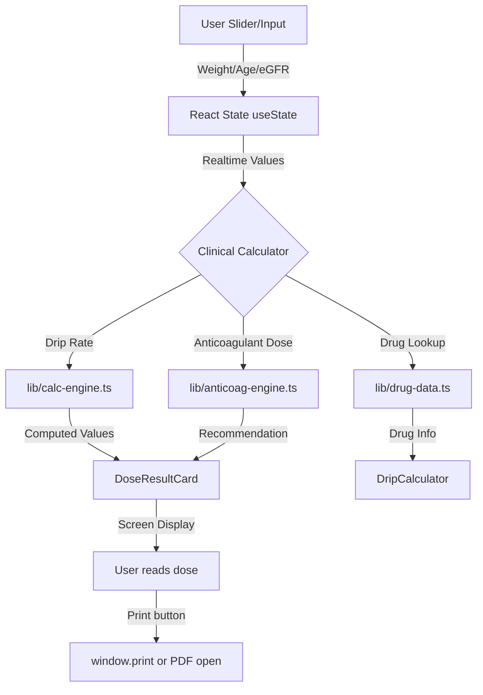

# Architecture Guidelines

## 1. Core Components

| Component | Role | Dependencies |
|---|---|---|
| `app/layout.tsx` | Root layout. Sarabun font (Google Fonts), ThemeProvider (next-themes, dark default + light toggle, `attribute="data-theme"`). `suppressHydrationWarning` on `<html>` to prevent FOUC. | `next-themes`, `globals.css` |
| `app/page.tsx` | Home page. DashboardLayout wrapper with welcome card. | `DashboardLayout` |
| `app/globals.css` | Design system. Dark default + light theme tokens via `:root[data-theme='light']`. Single accent #5E6AD2. Sidebar, card, slider, dose-result, sticker-box, clinical-warning, field-error, print styles. | None |
| `components/DashboardLayout.tsx` | Layout wrapper: Sidebar + ThemeToggle + main content area. | `Sidebar`, `ThemeToggle` |
| `components/Sidebar.tsx` | Flat sidebar nav (8 items, ordered by clinical urgency: Stroke first). Hospital logo in header (28px). Active item highlighted with accent border. | `next/link`, `next/navigation` |
| `components/ThemeToggle.tsx` | Dark/light toggle button. Uses `next-themes` `useTheme()`. Mounted check to prevent hydration mismatch. | `next-themes` |
| `components/SliderInput.tsx` | Labeled range slider with realtime value display. Used for weight (continuous 0.1 step) and age (stepped 1 step). | None |
| `components/DoseResultCard.tsx` | Number + context display: label, value, unit, context (formula), ceiling (range/max). Accent border + accent-bg. | None |
| `components/PatientInfoForm.tsx` | Patient info card: HN text input, eGFR text input (optional), weight slider (30-150, 0.1 step), age slider (18-120, 1 step). | `SliderInput` |
| `components/StickerBox.tsx` | Dashed patient sticker box for print area. Shows HN. | None |
| `components/DripCalculator.tsx` | IV infusion drip calculator. Drug selector (12 drugs), preparation selector, weight + dose sliders, realtime drip rate + bolus volume via calcDripRate/calcBolusVolume. DoseResultCard for results. Dual-units display for Esmolol. | `lib/drug-data`, `lib/calc-engine`, `SliderInput`, `DoseResultCard` |
| `lib/calc-engine.ts` | TypeScript port of calcDripRate() and calcBolusVolume(). Pure functions, fully typed. | None |
| `lib/anticoag-engine.ts` | TypeScript port of calcAnticoag(), calcHeparinInitialDose(), getHeparinTitration(), HEPARIN_STANDALONE_PROTOCOLS. Pure functions, fully typed. | None |
| `lib/drug-data.ts` | TypeScript port of EMERGENCY_DRUG_DATA (12 drugs). Interfaces: EmergencyDrug, DrugPreparation, DoseRange. Clinical data unchanged from original. | None |
| `lib/form-validate.ts` | React hook `useFormValidation()`. State-based: fail(), clear(), range(), min(), warn(), clearWarn(), clearAll(). Replaces DOM-manipulation validation with reactive pattern. | None |
| `app/orders/rtpa/page.tsx` | rt-PA Stroke FAST TRACK page. HTML blank print (window.print). | `DashboardLayout`, `RtpaOrder` |
| `app/orders/stemi/page.tsx` | STEMI Standing Order page. PDF pathway (opens source PDF in new tab). | `DashboardLayout`, `StemiOrder` |
| `app/orders/nstemi/page.tsx` | NSTEMI Standing Order page. HTML blank print. Uses calcAnticoag for anticoagulant recommendation. | `DashboardLayout`, `NstemiOrder` |
| `app/orders/pe/page.tsx` | Massive PE Fibrinolysis page. PDF pathway. | `DashboardLayout`, `PeOrder` |
| `app/orders/heparin/page.tsx` | Heparin Protocol page. PDF pathway. Uses calcHeparinInitialDose + getHeparinTitration. Titration assistant. | `DashboardLayout`, `HeparinOrder` |
| `app/orders/antivenom/page.tsx` | Antivenom Standing Order page. PDF pathway. Snake type selector, indication checkboxes, antibiotic toggle. | `DashboardLayout`, `AntivenomOrder` |
| `app/orders/sedation/page.tsx` | Post-Intubation Sedation page. PDF pathway. Fentanyl + Midazolam dual-drug calculator. | `DashboardLayout`, `SedationOrder` |
| `app/tools/drip-calculator/page.tsx` | IV Infusion Drip Calculator page. Realtime sliders, 12 drugs. | `DashboardLayout`, `DripCalculator` |
| `.github/workflows/deploy.yml` | GitHub Actions: build (npm ci + next build + vitest) → deploy to GitHub Pages via actions/deploy-pages@v4. | `out/` directory |

---

## 2. Data Flow

1. **Input (`Src`):** User adjusts sliders (weight, age, dose) and text inputs (HN, eGFR) in React client components. State updates trigger realtime recalculation via `useMemo`.
2. **Clinical Processing (`Transform`):** Input values passed to `lib/calc-engine.ts` (drip rates, bolus volumes) or `lib/anticoag-engine.ts` (heparin/enoxaparin/fondaparinux dosing, titration). `lib/drug-data.ts` provides drug catalog (concentrations, dose ranges, safety warnings).
3. **Display (`Dest`):** Computed values rendered in `DoseResultCard` (value + unit + context + ceiling). Print via `window.print()` (HTML blank) or `window.open()` (source PDF in new tab).

---

## 3. Offline & Deployment

| Entity | Strategy |
|---|---|
| **Static Export** | `output: 'export'` in `next.config.ts` → `out/` directory with static HTML/CSS/JS. `basePath: '/er-hub'` for GitHub Pages subpath. `trailingSlash: true` for clean URLs. |
| **PWA** | Removed. No service worker, no manifest.json. (Previously had offline cache for ED wifi outages — dropped per rewrite scope.) |
| **GitHub Actions** | `.github/workflows/deploy.yml`: npm ci → next build → vitest → upload `out/` as Pages artifact → deploy-pages@v4. Triggers on push to main. |
| **Print Pathways** | Two pathways (preserved from ADR-17): (1) PDF pathway (stemi, pe, heparin, antivenom, sedation) — opens source PDF from `public/docs/` in new tab via `window.open()`. (2) HTML blank print (rtpa, nstemi) — `window.print()` on rendered blank template. |

---

## 4. Clinical & System Warnings

- **W-01: SK Contraindication:** STEMI + PE pages block SK order generation if prior SK within 6 months is checked. Clinical warning shown, no order generated.
- **W-02: Individualized Dosing:** Heparin page — if any bleeding risk checkbox is checked, individualized dosing warning displayed instead of auto-calculated dose.
- **W-03: Max Dose Ceilings:** calc-engine and anticoag-engine enforce clinical max doses (e.g., Heparin bolus caps, rt-PA max 90mg/50mg, Fentanyl max 500 mcg/hr). DoseResultCard shows ceiling value.
- **W-04: Antivenom Indication Gate:** At least 1 indication checkbox must be checked before antivenom order can be generated. Warning shown if none checked.
- **W-05: Antibiotic Allergy Toggle:** Antivenom page — penicillin allergy radio toggles between Augmentin (default) and Ciprofloxacin+Clindamycin (allergy alternative).
- **W-06: Krait Auto-Indication:** Antivenom page — selecting Malayan krait or Banded krait auto-checks the "krait bite" indication (give antivenom immediately, don't wait for weakness).
- **W-07: TNK Age Dose Reduction:** STEMI page — age ≥ 75 halves TNK dose. Clopidogrel: age ≤ 75 → 4 tabs, age > 75 → 1 tab.
- **W-08: Print Layout:** `@media print` in globals.css hides sidebar, theme toggle, and `.no-print` elements. `@page { size: A4 portrait; margin: 0 }` for hospital record format.