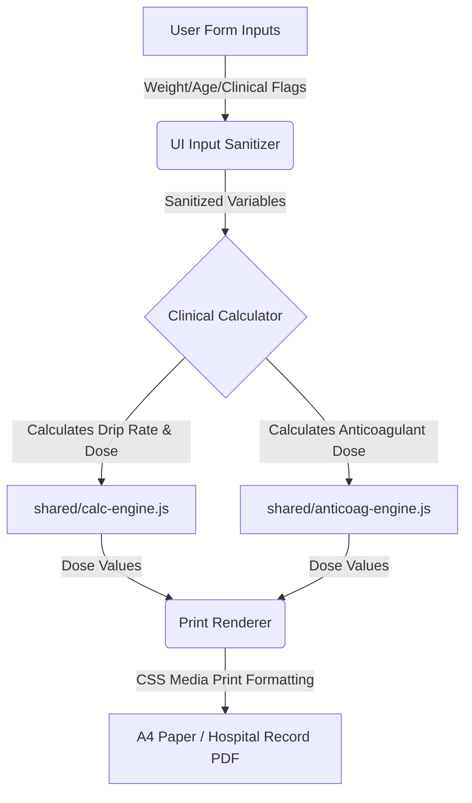

# Architecture Guidelines

## 1. Core Components

| Component | Role | Dependencies |
|---|---|---|
| `Hub (index.html)` | Application portal listing all ER Standing Orders and calculators in a single 3-column grid. Cards have color-coded left borders per medical category (Cardiac #c0392b, Pulmonary #2980b9, Neurology #8e44ad, Anticoagulation #16a085, Toxicology #d35400, Procedural #27ae60, Tools #2c3e50). No section titles, no emoji icons, no print-blank buttons (removed per ADR-09). Stroke FAST TRACK is first card. Portal header (logo + title card) removed — nav bar replaces it. Tablet (600–900px) → 2 columns, mobile (<600px) → 1 column. Backward-compatible redirect for legacy rTPA URLs. | None |
| `calc-engine.js` | Generic mathematical engine computing infusion drip rates (mL/hr) and loading doses (mL). | None |
| `anticoag-engine.js` | Logic engine determining Heparin/LMWH doses and titration changes based on clinical indications. | None |
| `drug-data.js` | Structured catalog of concentrations, dose limits, safety ceilings, and titration instructions for all 12 IV drugs. | None |
| `components.js` | Renders common UI elements: patient info blocks, sticker boxes, date-time inputs, sticky top navigation bar (`injectNavBar` — accepts optional `homeHref` for path flexibility, auto-detects title from `document.title`), floating print action bar (`showFloatBar`/`hideFloatBar`). | None |
| `orders/*.html` | Specialized clinical worksheets (rt-PA, STEMI, NSTEMI, PE, Antivenom, Heparin, Sedation) displaying forms and generating print layouts. All 7 files share a unified DOMContentLoaded pattern: listener registration → `print-blank-direct` check at end (not early-return). | `shared/base.css`, `shared/print.css`, `shared/calc-engine.js`, `shared/components.js` |
| `tools/drip-calculator.html` | IV infusion drip rate calculator for 12 high-alert drugs. Now loads `components.js` and uses `injectNavBar()` for nav consistency. No print flow (no `print.css`). | `shared/base.css`, `shared/calc-engine.js`, `shared/drug-data.js`, `shared/components.js` |
| `index.html` | Portal hub with nav bar (`injectNavBar('index.html')`). 3-column card grid, backward-compat redirect. Body uses inline `display: block` override. | `shared/base.css`, `shared/components.js` |

---

## 2. Data Flow

1. **Input Collection (`Src`):** User inputs patient variables (HN, age, weight, eGFR) and selects drug/indication options in the active worksheet.
2. **Clinical Processing (`Transform`):** Sanitized inputs are processed by `shared/calc-engine.js` or `shared/anticoag-engine.js` referencing data structures in `shared/drug-data.js`.
3. **Print Output (`Dest`):** Output values are written directly to target print containers in the DOM, then converted into an official A4 medical order sheet via the browser print driver using `shared/print.css`.

---

## 3. Offline Decisions

| Entity | Conflict Resolution | Sync Strategy |
|---|---|---|
| `Patient Form State` | Client-only state. Form resets immediately on navigation or tab close. | No server sync. Strictly offline-first. |
| `Calculation Engine` | Pure functional operations. Standard math guarantees deterministic outcomes. | Stored as local `.js` scripts. Loaded from disk. |
| `PWA Assets Cache` | Local service worker enforces version caching. | Assets cached in browser. Auto-updates on cache-busting tag change. |

---

## 4. Clinical & System Warnings

- **W-01: Absolute SK Contraindication:** Users selecting Streptokinase (SK) who flag a prior SK administration within 6 months are permanently blocked from generating the order. They must use Tenecteplase (TNK).
- **W-02: Individualized Dosing Bypass:** For Heparin and Antivenom protocols, matching any pre-defined clinical risk factors (e.g., active bleeding, platelet count < 50,000) disables automatic calculations, forcing user consultation with the attending staff.
- **W-03: Max Dose Ceilings:** The calculation engine automatically caps values at the clinical upper limit (e.g., Fentanyl drip maxed at 500 mcg/hr, rt-PA maxed at 90mg or 50mg based on regimen) to prevent accidental overdosage.
- **W-04: Print Blank Order Bypass:** Users can print empty orders via the worksheet's own "🖨️ ใบสั่งยาเปล่า (Blank Order)" button. This renders a blank preview on-screen without auto-printing; the clinician reviews and prints via the standard green print button or the floating action bar. The home portal no longer has print-blank buttons (removed per ADR-09). Both pathways bypass all screen validation constraints and output standard checklists with empty dotted lines for manual clinical entries.
- **W-05: Lab/IV/O2 Hygiene:** Lab investigations, IV fluids, oxygen, monitoring, and non-drug continuation orders are always rendered as unchecked (☐) in the print output — even when patient data has been entered. Only drug-related orders (ASA, Clopidogrel, Fentanyl, Midazolam, Heparin dosing, Antivenom dosing, Antibiotics) auto-check (☑) based on input data. This prevents accidental pre-checking of investigations that must be ordered by the attending physician.
- **W-06: A4 Print Fit:** All order pages use `@page { size: A4 portrait; margin: 0 }` with `body { width: 210mm; display: block !important }` to override the screen flex layout. Results container uses `padding: 5mm` for print margins. The 5-column order grid drops `min-width: 900px` in print, uses `font-size: 8pt`, and `page-break-inside: avoid` to keep the grid intact on one page. Stroke-specific pages (rt-PA) use `width: 195mm; margin: 0 auto; padding: 3mm 0` with `page-break-before: always` for multi-page documents — matching the original rtpamnrh.vercel.app layout. Sticker box: 60mm × 20mm (compact, matching stroke page sticker dimensions). The sticky top navigation bar is hidden in print across all 7 order pages via `nav`, `.top-nav`, and `a[href*="index.html"]` selectors in `@media print`. rt-PA order grid includes `10em` spacer divs before doctor signature lines (ลงชื่อแพทย์ ER/MED and ลงชื่อแพทย์ MED) to fill the A4 page height. Portal header padding reduced to `16px 20px` (was `32px 20px`), logo to `64px` (was `88px`), margin-bottom to `16px` (was `30px`) for a compact header.
- **W-07: Hardcoded Checkbox Reset on Blank Print:** All non-dynamic ☑ items (medications, monitoring instructions, diet orders) in the results area are tagged with IDs and explicitly reset to ☐ when printing a blank order. This prevents pre-checked medications (Clopidogrel, Ativan, Atorvastatin, Augmentin, etc.) from appearing on blank orders intended for new patients. Affected files: nstemi (12 items), antivenom (3 antibiotics + antivenom box class), sedation (Fentanyl bolus + 2 drip box classes), stemi (3 monitoring items).
- **W-08: Use-Current-Time Checkbox:** All 4 order files with the `use-current-time` checkbox (pe, heparin, antivenom, nstemi) now wire it to the date/time generation logic — when unchecked, date/time fields render as dotted lines instead of the current time. rtpa.html already implemented this pattern correctly.
- **W-09: Iframe Print Cleanup:** The home portal's `printBlankOrder()` function (retained for backward compatibility) uses `afterprint` event listener with a 5-minute fallback timeout, replacing the previous fixed 60-second timer that could destroy the iframe mid-print.
