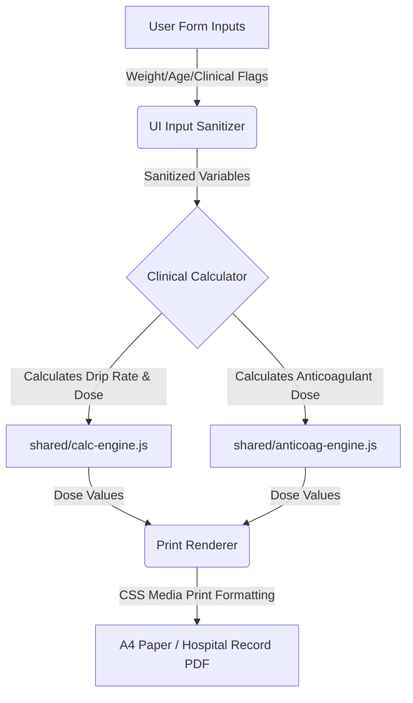

# Architecture Guidelines

## 1. Core Components

| Component | Role | Dependencies |
| --- | --- | --- |
| `calc-engine.js` | Generic mathematical engine computing infusion drip rates (mL/hr). | None |
| `clinical-engine.js` | Shared clinical logic engine containing lookup tables and formulas for GRACE score and eGFR (CKD-EPI 2021) calculations. | None |
| `anticoag-engine.js` | Logic engine determining Heparin/LMWH doses and titration changes based on clinical indications. | None |
| `drug-data.js` | Structured catalog of concentrations, dose limits, safety ceilings, and titration instructions for all 12 IV drugs. | None |
| `components.js` | Renders common UI elements: patient info blocks, sticker boxes (HN set via `textContent` for XSS safety), date-time inputs, sticky top navigation bar (`injectNavBar` — accepts optional `homeHref`, `logoSrc`, and `pageTitle` for path/logo/title flexibility; `pageTitle` can be `undefined` for auto-detect, empty string `''` to suppress, or explicit string to override; auto-detects remaining title from `document.title`, sets `role="navigation"`, adds `aria-label` to both Home link and title span), floating print action bar (`showFloatBar`/`hideFloatBar`). Float bar uses text-only labels (no emoji per ADR-09). Negative margin math (`width: calc(100% + var(--page-pad) * 2)`, `margin: calc(var(--page-pad) * -1)`) now reads `--page-pad` CSS var for flexible breakout from body padding (see `base.css` §2). | None |
| `print-bootstrap.js` | Shared print/page lifecycle: `handlePrintBlankDirect()` (URL param detection for HTML blank print), `handlePrintBlankDirectPdf(path)` (URL param detection → redirect to source PDF), `openBlankPdf(path)` (opens source PDF in new tab — user presses print manually, no cross-tab `.print()` per ADR-09), `showResults()` (unhide + float bar + scroll), `clearResults(formId, extraFn)` (reset + hide + focus), `getDateTimeHTML(useTime, date)`, `getBlankDateTimeHTML()`. 5 of 7 order pages use the PDF pathway (ADR-17); rtpa/nstemi keep HTML blank print. | `components.js` |
| `blank-print-engine.js` | Declarative blank-print reset engine. Each order page registers a manifest of reset rules (`{ id, value }` for textContent, `{ id, html }` for innerHTML, `{ id, className }` for class override, `{ id, style }` for style props, `{ selector, checked }` for checkboxes). `apply()` executes all rules. Used by rtpa.html and nstemi.html only (ADR-17 — 5 other pages now open source PDFs instead). Fixes the ADR-10 bug class at the root — adding a new protocol page is now a manifest array, not a hand-written reset block. | None |
| `form-validate.js` | Non-blocking form validation — replaces `alert()` calls across all order pages. `fail(inputId, msg)` highlights field + inline message. `warn(msg)` shows clinical warning banner. `range(inputId, min, max, msg)` and `min(inputId, minVal, msg)` for numeric validation. `clearAll()` resets all errors. Uses existing `.field-error` CSS + new `.inline-error-msg` and `.clinical-warning` classes. | `components.js` |
| `orders/*.html` | Specialized clinical worksheets (rt-PA, STEMI, NSTEMI, PE, Antivenom, Heparin, Sedation). All 7 files use `ED_PRINT_BOOTSTRAP` for page lifecycle and `ED_VALIDATE` for non-blocking validation. All in-page title/guideline headers and dividers are deleted; forms start directly below the sticky top nav, relying on it as the single source of truth. 5 pages (stemi, pe, heparin, antivenom, sedation) use `ED_PRINT_BOOTSTRAP.openBlankPdf()` to open source PDFs from `docs/` in a new tab (ADR-17). 2 pages (rtpa, nstemi) keep `ED_BLANK_PRINT` for HTML blank-print (no source PDF). Page-specific JS reduced to: form submit handler (clinical logic) + event listeners for protocol-specific UI. `nstemi.html` also loads `shared/clinical-engine.js`. | `shared/base.css`, `shared/print.css`, `shared/calc-engine.js` or `shared/anticoag-engine.js`, `shared/components.js`, `shared/print-bootstrap.js`, `shared/form-validate.js`, `shared/clinical-engine.js` (rtpa/nstemi also load `shared/blank-print-engine.js`) |
| `tools/drip-calculator.html` | IV infusion drip rate calculator for 12 high-alert drugs featuring interactive slider and number input coupling, real-time calculation, safety color categories, generalized dual units display, and sessionStorage weight persistence. | `shared/base.css`, `shared/calc-engine.js`, `shared/drug-data.js`, `shared/components.js` |
| `index.html` | Portal hub with custom Braun × Mid-Century Modern layout. Displays active and prototype clinical standing orders and calculators in a semantic vertical ordered list with 1px hairlines, tabular numerals, muted category styles, and signal orange indicators for time-critical actions. Implements header wordmark, hospital logo, and footer. Registers service worker for offline PWA support with dynamic reload notification. Body uses custom typography and colors. | `shared/base.css`, `shared/components.js`, `service-worker.js`, `manifest.json` |
| `service-worker.js` | PWA offline cache. Network-first for navigation, cache-first for assets. Caches all HTML/CSS/JS + 4 shared behavior modules + logo PNG + 5 source PDFs + Google Fonts (including `Inter Tight`). `CACHE_VERSION` bumped to `er-hub-v15`. Enables full offline access during ED wifi outages. | None |
| `manifest.json` | PWA manifest. App name, theme color, logo icon reference. Enables installable app + offline. | `docs/Logo_of_Maharat_Nakhon_Ratchasima-removebg-preview.png` |

---

## 2. Data Flow

1. **Input Collection (`Src`):** User inputs patient variables (HN, age, weight, creatinine — eGFR derived automatically via CKD-EPI 2021 from Cr+age+sex in shared/anticoag-engine.js) and selects drug/indication options in the active worksheet.
2. **Clinical Processing (`Transform`):** Sanitized inputs are processed by `shared/calc-engine.js` or `shared/anticoag-engine.js` referencing data structures in `shared/drug-data.js`.
3. **Print Output (`Dest`):** Output values are written directly to target print containers in the DOM, then converted into an official A4 medical order sheet via the browser print driver using `shared/print.css`.

---

## 3. Offline Decisions

| Entity | Conflict Resolution | Sync Strategy |
| --- | --- | --- |
| `Patient Form State` | Client-only state. Form resets immediately on navigation or tab close. | No server sync. Strictly offline-first. |
| `Calculation Engine` | Pure functional operations. Standard math guarantees deterministic outcomes. | Stored as local `.js` scripts. Loaded from disk. |
| `PWA Assets Cache` | Service worker (`service-worker.js`) registered on index.html. Network-first for navigation, cache-first for static assets. Caches all HTML/CSS/JS + Google Fonts for offline access. | Assets cached in browser via Cache API. Cache version bumped on deploy. |

---

## 4. Clinical & System Warnings

- **W-01: Absolute SK Contraindication:** Users selecting Streptokinase (SK) who flag a prior SK administration within 6 months are permanently blocked from generating the order. They must use Tenecteplase (TNK).
- **W-02: Individualized Dosing Bypass:** For Heparin and Antivenom protocols, matching any pre-defined clinical risk factors (e.g., active bleeding, platelet count < 50,000) disables automatic calculations, forcing user consultation with the attending staff.
- **W-03: Max Dose Ceilings:** The calculation engine automatically caps values at the clinical upper limit (e.g., Fentanyl drip maxed at 500 mcg/hr, rt-PA maxed at 90mg or 50mg based on regimen) to prevent accidental overdosage.
- **W-04: Print Blank Order Bypass:** Two pathways (ADR-17): (1) 5 pages (stemi, pe, heparin, antivenom, sedation) open the source PDF from `docs/` in a new browser tab via `ED_PRINT_BOOTSTRAP.openBlankPdf(path)` — the clinician presses print manually in the native PDF viewer (no cross-tab `.print()` per ADR-09). (2) 2 pages (rtpa, nstemi) render a blank HTML template on-screen via `ED_BLANK_PRINT.apply()` — clinician prints via the green print button or floating action bar. Both pathways bypass all screen validation. The home portal no longer has print-blank buttons (removed per ADR-09). `?print-blank-direct=true` URL param works for both: PDF pages redirect to the PDF, HTML pages trigger blank print.
- **W-05: Lab/IV/O2 Hygiene:** Lab investigations, IV fluids, oxygen, monitoring, and non-drug continuation orders are always rendered as unchecked (☐) in the print output — even when patient data has been entered. Only drug-related orders (ASA, Clopidogrel, Fentanyl, Midazolam, Heparin dosing, Antivenom dosing, Antibiotics) auto-check (☑) based on input data. This prevents accidental pre-checking of investigations that must be ordered by the attending physician.
- **W-06: A4 Print Fit:** All order pages use `@page { size: A4 portrait; margin: 0 }` with `body { width: 210mm; display: block !important }` to override the screen flex layout. Results container uses `padding: 5mm` for print margins. The 5-column order grid drops `min-width: 900px` in print, uses font-size: `8pt` / `8.5pt` (scaled to `9.5pt` / `9pt` for NSTEMI), and `page-break-inside: avoid` to keep the grid intact on one page. Stroke-specific pages (rt-PA) use `width: 195mm; margin: 0 auto; padding: 3mm 0` with `page-break-before: always` for multi-page documents — matching the original rtpamnrh.vercel.app layout. Sticker box: 60mm × 20mm (compact, matching stroke page sticker dimensions). The sticky top navigation bar is hidden in print across all 7 order pages via `nav`, `.top-nav`, and `a[href*="index.html"]` selectors in `@media print`. rt-PA order grid includes `10em` spacer divs before doctor signature lines to fill the height. NSTEMI page uses a flex-grow blank space container (`.order-blank-space`) and `margin-top: auto` on signatures (`.print-signature-block`) inside the column cells to automatically stretch content to the bottom of the page. Portal header padding reduced for compact portal.
- **W-07: Hardcoded Checkbox Reset on Blank Print:** All non-dynamic ☑ items (medications, monitoring instructions, diet orders) in the results area are tagged with IDs and explicitly reset to ☐ when printing a blank order. This prevents pre-checked medications (Clopidogrel, Ativan, Atorvastatin, Augmentin, etc.) from appearing on blank orders intended for new patients. Affected files: rtpa (10 items), nstemi (12 items) — the 2 pages that still use HTML blank-print. The 5 PDF-pathway pages (stemi, pe, heparin, antivenom, sedation) no longer use `ED_BLANK_PRINT` (ADR-17). Antivenom antibiotic toggle (F3 fix, ADR-17): `p-augmentin` and `p-cipro-clinda` now toggle based on penicillin-allergy radio input — no longer both hardcoded ☑.
- **W-08: Use-Current-Time Checkbox:** All 5 order files with the `use-current-time` checkbox (pe, heparin, antivenom, nstemi, rtpa) wire it to the date/time generation logic — when unchecked, date/time fields render as dotted lines instead of the current time.
- **W-09: Iframe Print Cleanup (Deprecated):** The home portal's `printBlankOrder()` function was removed (ADR-13). ADR-09 eliminated all portal print-blank buttons, making the function dead code. The `afterprint` + 5-minute timeout pattern is documented for historical reference only.
- **W-10: Nav Overflow Fix (2026-07-02, Phase 1 — BUG-01):** Introduced CSS custom property `--page-pad` to decouple `.top-nav` breakout math from hardcoded body padding. Pages set `body { --page-pad: 0px }` (index.html) or inherit default `--page-pad: 20px` (order pages). Nav margin calculations now read `calc(var(--page-pad) * -1)` instead of `-20px`. Responsive breakpoints update `--page-pad` cleanly at media query boundaries (10px at 900px, 8px at 600px). Eliminates 20px overflow on pages where body padding differs from default.
- **W-11: PE Hard-Stop Doesn't Stop Fix (2026-07-02, Phase 1 — BUG-02):** Added `return;` statement immediately after both `ED_VALIDATE.warn()` calls (lines 316 & 322) in `pe.html` for absolute-CI and SK-repeat checks. Also retracts stale order on re-submission via `classList.add('hidden')` on results-container. Prevents clinician from accidentally printing contraindicated PE standing order via Ctrl+P despite print-button being visually locked. New structural regression guard: `tests/order-safety-guard.test.js` (30 tests) scans all order files for this hard-stop pattern and asserts `return;` follows `warn()` within 4 lines.
- **W-12: injectNavBar pageTitle Parameter (2026-07-02, Phase 3 — BUG-04):** Extended `injectNavBar()` signature to accept optional third parameter `pageTitle`. Can be `undefined` (auto-detect from `document.title`), empty string `''` (suppress title, show only logo + "Home"), or explicit string (override title). `index.html` passes `''` → homepage shows only logo + Home link, no redundant "MNRH-ED Standing Order Hub" title. Eliminates visual redundancy on the portal page.
- **W-13: SW Precache Robustness + Retry Logic (2026-07-02, Phase 3 — BUG-05):** Replaced `cache.addAll(ASSETS)` with custom `fetchWithRetry()` helper (2 retry attempts, 100ms exponential backoff) + `Promise.allSettled()` precache loop. Individual asset fetch failures no longer block the entire install event. Failed assets logged as warnings but don't prevent SW activation. Next fetch will auto-retry missing assets. Resilient to transient network issues during offline access cache setup. Bumped `CACHE_VERSION` from `er-hub-v1` to `er-hub-v2`.
- **W-14: NSTEMI Dead ID Reference Safety (2026-07-04):** All elements queried in standing order handlers must be statically validated against DOM declarations. The ID integrity guard regression suite enforces that no queried IDs in `$()` or registry manifests are missing in the HTML source, ensuring zero runtime TypeErrors on execution.
- **W-15: Homepage Braun × Mid-Century Modern Redesign & SW v14 (2026-07-04):** Revamped the portal dashboard with a Braun-restrained aesthetic. Replaced the 3-column card grid with semantic vertical lists using tabular-nums ordering, hairline separators, and muted text category badges. The Signal Orange dot is reserved strictly for time-critical items. The top-nav has a blue gradient background, 38px logo height, and supports dynamic responsive title parsing inside `injectNavBar()` which splits and truncates page titles (e.g., `NSTEMI V2.1.1` instead of the full guideline block) on viewports <=900px to prevent text wrapping. Synchronized top-nav padding to `0 16px` at <=768px in base.css to ensure horizontal alignment of the logo on mobile. Shortened the homepage's nav-right update date metadata to `26-07-04`. Added `reg.update()` in `index.html` to force immediate SW update checks, and bumped `CACHE_VERSION` to `er-hub-v14`.
- **W-16: Portal Hover Refinement, Nav Braun White & Background Warmth (2026-07-04):** Replaced the portal order-row warm-grey hover (`#ece9df`) with a slate blue hover (`#49628d` — same 218° hue as the nav gradient, lower saturation/higher lightness per Braun restraint). All hovered row text (num, category, title, status, arrow) transitions to Braun White `#F0EDE5`. A `4px` left border sentinel (`border-left: 4px solid transparent` at rest → `#F0EDE5` on hover) provides a minimal standout without layout shift — achieved by widening rest-state padding from `12px 16px` to `12px 16px 12px 12px`. Transition now covers `background-color`, `border-left-color`, and `color`. Muted category text colors (`.cat-neuro/cardiac/pulmonary/anticoag/tox/procedural/tools`) explicitly wired to CSS vars. Portal background `--paper` darkened from `#f4f2ec` → `#ebe7df` for a warmer, richer surface. Navigation text (`nav-home`, `nav-title`, `nav-center`, `nav-right`) changed from `#fff` / `rgba(255,255,255,0.85/0.7)` to flat Braun White `#F0EDE5` across `shared/base.css` (all standing order pages) and `index.html` overrides (homepage). WCAG AA verified: `#F0EDE5` on `#49628d` = **5.23:1** contrast ratio.

---

## 5. Architectural Decision Records (ADRs) — Part 2

### ADR-18: Test Coverage & CSS Custom Properties (2026-07-02 Audit)

**Context:** Post-ADR-17 audit (v3, 2026-07-02) identified three infrastructure gaps: (1) zero test coverage for shared behavior modules (`form-validate.js`, `print-bootstrap.js`), (2) nav bar hard-coded to `20px` margins breaks on pages with custom body padding (BUG-01), (3) PE hard-stop warn doesn't actually stop (BUG-02 — returns false but execution continues), (4) homepage displays redundant title in nav bar (BUG-04), (5) service-worker precache is brittle (BUG-05).

**Decision:**

  1. **Phase 1 — Clinical Safety (BUG-01 & BUG-02 + Regression Guard):**
     - BUG-01 (Nav Overflow): Introduced `--page-pad` CSS custom property. `index.html` sets `body { --page-pad: 0px }`, order pages inherit/default `--page-pad: 20px`. `.top-nav` margin calculations now read `calc(var(--page-pad) * -1)` instead of hardcoded `-20px`. Responsive breakpoints update `--page-pad` (10px at 900px, 8px at 600px). Eliminates overflow on pages with non-default body padding.
     - BUG-02 (PE Hard-Stop No-Op): Added `return;` immediately after both `ED_VALIDATE.warn()` calls in `pe.html` (lines 316 & 322). Also retracts stale order via `classList.add('hidden')`. Now matches correct pattern in `stemi.html`/`antivenom.html`.
     - Regression Guard: Added `tests/order-safety-guard.test.js` (30 tests) — structural guard that scans all order pages for the hard-stop pattern, asserts `return;` follows `warn()` within 4 lines. **Catches BUG-02 if accidentally reverted.**
  2. **Phase 2 — Test Coverage:**
     - `tests/form-validate.test.js` (63 tests) — contract tests for ED_VALIDATE module. Covers: `fail()`, `clear()`, `range()`, `min()`, `warn()`, `clearWarn()`, `clearAll()`. Tests non-blocking behavior, boundary values, PE weight 30–200kg protocol, hard-stop pattern.
     - `tests/print-bootstrap.test.js` (31 tests) — contract tests for ED_PRINT_BOOTSTRAP module. Covers: `handlePrintBlankDirect()`, `handlePrintBlankDirectPdf()`, `openBlankPdf()`, `showResults()`, `clearResults()`, date/time helpers. Tests print-pathway detection, URL params, blank-order workflow, results hide/show, form reset.
     - All 60 new tests pass (124/124 total suite).
  3. **Phase 3 — Polish (BUG-04 & BUG-05):**
     - BUG-04 (Homepage Title): Extended `injectNavBar()` signature to accept optional `pageTitle` param. `undefined` = auto-detect from `document.title`, `''` = suppress title, explicit string = override. `index.html` passes `''` → homepage shows only logo + "Home", no redundant title.
     - BUG-05 (SW Precache Robustness): Replaced `cache.addAll(ASSETS)` with custom `fetchWithRetry()` helper (2 retries, 100ms exponential backoff) + `Promise.allSettled()` loop. Individual fetch failures no longer block install. Failed assets logged as warnings. Next fetch auto-retries. Bumped `CACHE_VERSION` from `er-hub-v1` to `er-hub-v2`.

**Rationale:** The CSS custom property approach isolates nav layout logic from page-specific body padding, making it resilient to future pages with custom layouts. The hard-stop `return;` fix is a critical patient-safety change — it closes the risk of contraindicated orders being printable. The regression guard ensures this class of bug cannot reappear without test failure. Test coverage on shared modules provides a safety net for future refactoring. The `pageTitle` param eliminates redundant nav titles on pages where auto-detect duplicates content. The SW precache robustness ensures offline access works reliably even with transient network issues during cache setup.

---

### ADR-20: NSTEMI Clinical Dosing Safety & Performance Optimization (2026-07-05 Audit)

**Context:** Following a comprehensive codebase audit, several clinical safety and code maintainability issues were addressed: (1) clinicians could select/print anticoagulants without providing renal data (Cr/age/sex), creating a dosing risk; (2) two separate creatinine inputs existed (#creatinine and #grace-creatinine) with a fragile event-based two-way sync; (3) rendering the GRACE breakdown table and print header/sticker box on every keystroke via innerHTML was highly inefficient; (4) duplicate alias functions and unused code existed in the worksheet logic; and (5) the navigation bar was constructed using unsanitized innerHTML values.

**Decision:**

1. **Phase 1 — Clinical Safety Gating:**
   - Greyed out/disabled the anticoagulation selection panel and displayed a red warning banner (*"กรุณากรอก Cr + อายุ + เพศ เพื่อคำนวณ eGFR"*) when eGFR is null.
   - Disabled all order generation/print action buttons until a valid eGFR is computed.
   - Removed the silent `egfrForCalc = 90` fallback to prevent downstream errors.
   - Wired the print date/time generation logic to stamp the current date and time on active order generation using `ED_PRINT_BOOTSTRAP.getDateTimeHTML()`.

2. **Phase 2 — Dead Code Elimination:**
   - Removed duplicate event listeners, unused CSS selectors (`.killip-group`, `.anticoag-banner`, `.section-header`), and unused CSS variables.
   - Added support for direct `shortTitle` navigation bar configurations to bypass fragile title parser regex lookups.

3. **Phase 3 — Performance & Modularization:**
   - Synchronized creatinine inputs by maintaining separate inputs for patient info Creatinine (`#creatinine`) and GRACE Creatinine (`#grace-creatinine`) to support standalone calculations, but implementing a robust two-way input synchronization handler so they always match.
   - Pre-rendered static table rows for the GRACE score breakdown on load and updated only the `textContent` of targeted cells in `calculateAndRender()` instead of wiping and replacing the innerHTML.
   - Extracted all clinical lookup tables and equations into a new shared engine module: `shared/clinical-engine.js`.
   - Refactored and decomposed the `calculateAndRender()` monolith into isolated calculation and rendering helper functions.
   - Rewrote navigation bar generation using native browser DOM APIs instead of `innerHTML` strings to prevent potential XSS vectors.

**Rationale:** Clinical safety is guaranteed by enforcing renal data entry before allowing high-alert anticoagulation choices. Performance is dramatically improved by replacing raw innerHTML string concatenation and parsing with targeted DOM element updates and static element caching. Extrapolating logic to the clinical engine prevents duplicate code and establishes a modular framework for future standing orders. Dom sanitization enforces strict security hygiene.

---

### ADR-19: NSTEMI UI Overhaul — 2025 ACC/AHA Guideline + CKD-EPI 2021 (2026-07-02)

**Context:** NSTEMI Standing Order page (v1.x) had structural issues: (1) eGFR was a manual input field instead of derived value, violating single-source-of-truth principle — creatinine is the measured value, eGFR should be calculated; (2) anticoagulant dosing used outdated age-based criteria (age ≥75 → 0.75 mg/kg) from CR-NSTEMI document, which is STEMI+fibrinolytic-specific and NOT applicable to NSTEMI per 2025 ACC/AHA guideline; (3) troponin kinetics lacked manual time input capability for %rising calculation; (4) header/nav redundancy with ESC 2023 reference only.

**Decision:**

  1. **Engine Updates (shared/anticoag-engine.js):**
     - Added `calcEGFR_CKDDEPI2021(creatinine, age, sex)` — implements CKD-EPI 2021 creatinine equation (race-free): `eGFR = 142 × min(Scr/κ, 1)^α × max(Scr/κ, 1)^-1.200 × 0.9938^Age × (1.012 if female)` where κ = 0.7 (female) / 0.9 (male), α = -0.241 (female) / -0.302 (male). Returns eGFR in mL/min/1.73m².
     - Rewrote `calcAnticoag()` — removed age ≥75 branch (was 0.75 mg/kg, incorrect for NSTEMI). New logic: eGFR ≥30 → Fondaparinux 2.5 mg SC OD + Enoxaparin 1 mg/kg SC q12h; eGFR 15-29 → Enoxaparin 1 mg/kg SC q24h; eGFR <15 → Heparin drip. Aligns with 2025 ACC/AHA/ACEP/NAEMSP/SCAI Guideline for Management of Patients With Acute Coronary Syndromes.
     - Added 6 unit tests for `calcEGFR_CKDEPI2021()` (male/female, age/Scr ranges, invalid inputs) + updated 8 anticoag tests to remove age-based assertions.
  2. **UI Simplification (orders/nstemi.html):**
     - Removed header block (h1 + hospital name + ESC 2023 + version string) — redundant with nav bar. Removed hr divider.
     - Patient info row: collapsed to single-line flexbox (`.patient-fields` nowrap): HN, Age, Weight(kg), Sex(M/F), Creatinine(mg/dL). eGFR derived live and displayed in `.egfr-derived` badge.
     - Added 3-column troponin kinetics section: H0 ng/L, H1 ng/L, H3 ng/L (each with manual time input HH:MM). %rising auto-calculated as ((H1-H0)/H0 × 100) and ((H3-H0)/H0 × 100).
     - GRACE Variables: Creatinine input synced with Patient Info Creatinine (same `id="creatinine"` referenced in both sections). eGFR no longer an input — removed to prevent data conflict.
     - Continuation column (Col 5): Replaced hardcoded "Enoxaparin 40 mg SC OD" checkbox with 3 anticoagulant options (Fondaparinux / Enoxaparin / Heparin). Each shows calculated dose from engine + hint text (eGFR-based indication). Only the doctor-selected medication receives ☑ check in print output.
     - Nav bar: passed explicit title with 2025 ACC/AHA reference: `"NSTEMI Standing Order — MNRH | 2025 ACC/AHA Anticoag Guideline + CKD-EPI 2021 eGFR"`.
  3. **Removed auto-time features:** Deleted "Use current time" checkbox (`use-current-time`) and all `h1t`/`h3t` computed time logic. Troponin times now manual-only for clinical accuracy.

**Rationale:** eGFR is a derived clinical value, not an input — deriving it from creatinine via CKD-EPI 2021 (gold-standard equation) prevents data entry errors and ensures guideline compliance. The 2025 ACC/AHA guideline supersedes the outdated age-based enoxaparin dosing from CR-NSTEMI document (which applies only to STEMI fibrinolysis). Manual troponin times align with real-world ED workflow where draw times vary by patient and are not always at fixed intervals. The single-line patient info layout reduces vertical space, allowing more room for clinical data below.

**Tests:** All 130 tests pass (6 new CKD-EPI tests + 8 updated anticoag tests). No regressions.

**Consequences:** Older NSTEMI orders printed with v1.x will have different enoxaparin dosing than v2.0 for patients age ≥75 (was 0.75 mg/kg, now 1 mg/kg q24h if renal impairment). This is clinically correct per 2025 guideline.

---

### ADR-20: NSTEMI Standing Order v2.1 — Simplification, Safe eGFR Formatting, and Regression Guards (2026-07-04)

**Context:**
A post-implementation audit of NSTEMI standing order page (v2.0) revealed:

1. Dead DOM element references (`p-h0`, `p-h1`, `p-h3`) left from previous versions caused a Javascript `TypeError` upon calculation execution, preventing result generation and float bar display.
2. Troponin timing inputs (`trop-time-h0`/`1`/`3`) were redundant as the draws are logged in the EMR rather than the standalone sheet.
3. eGFR formatting was inconsistent (some places 1 decimal, some unformatted raw floats) and lacked null guards.
4. The blank order template preview had to be manually toggled.

**Decision:**

1. **DOM & JS Cleanup:**
   - Deleted dead `p-h0`/`p-h1`/`p-h3` print references and screen timing update lines from Javascript.
   - Removed manual troponin timing inputs `#trop-time-h0`/`1`/`3` and `.troponin-times` DOM block.
   - Simplified printed troponin section `#p-troponin-values` to display only static results (e.g. `H0: 12`, `H1: 15 → +25.0%`).
   - Retained the duplicate `#grace-creatinine` input and implemented two-way sync with `#creatinine` to prevent data entry friction.
   - Renamed print Column 1 header to "Progress note" and removed the pharmacist signature block ("ลงชื่อเภสัช:").
2. **eGFR Badge & Layout Repositioning:**
   - Moved the screen eGFR badge `#screen-egfr` directly next to the Creatinine input in the patient demographics row.
   - Relocated the `#troponin-from-rphch` checkbox to the header of the Troponin section.
   - Reverted Risk Stratification back to the original vertical list layout using standard labels.
   - Moved interactive anticoagulant selection radio buttons out of print preview (Column 5) and into the screen results container, adding Enoxaparin frequency q12h vs OD sub-selections with GFR-only hint text "(1 mg/kg — GFR < 30 → once daily)".
   - Relocated print anticoagulant output (`#p-anticoag`) from print Column 3 (One Day Orders) to print Column 5 (Continuation).
3. **eGFR Safe Formatting:**
   - Standardised all eGFR outputs to 2 decimal places (`.toFixed(2)`).
   - Safe-guarded printed output: `egfr !== null ? egfr.toFixed(2) : '___'` to prevent null crashes on form resets.
4. **Blank-First UX:**
   - Auto-trigger the blank print layout by clicking `print-blank-btn` on page load.
5. **Precache Robustness & Testing:**
   - Bumped `CACHE_VERSION` to `er-hub-v3` in `service-worker.js`.
   - Created `tests/id-integrity-guard.test.js` to parse all forms and verify query ID existence in the DOM, preventing dead reference crashes.
   - Bumped NSTEMI version to `2.1.0`.

**Rationale:**
Manual troponin draw times added layout complexity without clinical benefit. Two-way creatinine sync is retained to maintain consistent data entry between demographic and GRACE variables. Reverting Risk Stratification to the original vertical layout keeps layout styling consistent with other order sheets. Separating the calculated eGFR badge next to the creatinine input visually links the input and derived outputs. Safe-guarding formatting and removing dead DOM references prevents runtime TypeErrors. Auto-triggering the blank print preview ensures clinicians see the standing order layout immediately. Bumping SW cache versions ensures quick client updates. The ID integrity guard prevents future dead reference regressions across the suite.

**Tests:**
All 138 tests pass, including the new regression guard testing all 8 interactive files.

---

### ADR-22: Homepage Design Optimization & Local CSS Scoping (2026-07-04)

**Context:** The portal homepage (`index.html`) visually felt outdated and flat compared to modern web design standards. The user requested a visual optimization using `/modern-web-guidance` to create a premium clinical dashboard.

**Decision:**

  1. **Visual Overhaul:** Optimized the layout with a subtle radial gradient background (`#f8fafc` to `#e2e8f0`), glassmorphic portal cards (soft blur, semi-transparent borders, premium drop shadows, `12px` border-radius), and uppercase text tags (e.g., "NEUROLOGY", "CARDIAC") corresponding to the color-coded categories. Tuned card dimensions to be more compact (padding: `16px 20px`, min-height: `80px`, grid gap: `16px`) for an ultra-sleek layout.
  2. **Interactivity & Motion:** Added hover animations including a card vertical translation (`translateY(-4px)`), a color-matched shadow glow, a vertically centered chevron arrow indicator (`→`), and a subtle radial gradient glow inside the card. Implemented a staggered load animation (`fadeInUp`) for the grid cards using CSS animation delays.
  3. **Local Styling Scope:** Scoped all visual styles locally within the `<style>` tag of `index.html` instead of modifying `shared/base.css` to prevent any regressions or layout shifts on the other 7 clinical standing order pages.
  4. **PWA Version Bump:** Bumped the service worker `CACHE_VERSION` to `er-hub-v6` to force immediate client browser updates.
  5. **Favicon Replacement:** Replaced `favicon.svg` with the hospital logo PNG (`docs/Logo_of_Maharat_Nakhon_Ratchasima-removebg-preview.png`) as the favicon across all 9 pages, updated `manifest.json` icons, and removed `favicon.svg` from the cache list.

**Rationale:** Scoping styles locally inside `index.html` satisfies the surgical modification rule by completely isolating the homepage visual design, guaranteeing zero regression risk for the clinical order sheets. Branded category labels and interactive chevrons organize the grid without relying on sections or platform-specific emojis. Staggered animations make the interface feel responsive and modern. Using the official hospital logo as the favicon provides unified branding and consistent tab identification. Compact card sizing increases information density and usability on high-pressure ED terminals.

---

### ADR-23: Enoxaparin Continue Order Checkbox Options (2026-07-04)

**Context:** Thailand clinical settings support Enoxaparin in pre-filled syringe sizes (0.4 ml [40 mg] and 0.6 ml [60 mg]). The NSTEMI continue order printed layout used manual blank lines, which required manual completion and did not guide clinical selection based on pre-packaged stock sizes.

**Decision:**

  1. **Print Layout Update:** Replaced blank lines in continue order (`p-anticoag`) with specific checkboxes formatted over 2 lines:
     - Line 1: `☐ Enoxaparin  ☐ 0.4 ml  ☐ 0.6 ml`
     - Line 2: (Indented 5 spaces) `SC  ☐ q 12 hr  ☐ OD  × 5 Days`
  2. **Auto-Checking Dosing Logic:** Added live calculation rules in `orders/nstemi.html`:
     - If patient weight >= 50 kg (dose >= 50 mg), check the `0.6 ml` box.
     - If patient weight < 50 kg (dose < 50 mg), check the `0.4 ml` box.
     - Frequency checkboxes (`q 12 hr` vs `OD`) are checked automatically matching the selected frequency on the screen.
  3. **Refined Guidance Note:** Split the clarification note into 2 lines for readability:
     - Line 1: `(1 mg/kg = [Dose] mg — GFR < 30 → once daily)`
     - Line 2: `(0.4 ml = 40 mg, 0.6 ml = 60 mg)`

**Rationale:** The updated layout reduces error-prone manual writing on printed forms. Formatting the checkboxes and instructions into 2 lines respectively prevents visual clutter in the narrow continuation column print space while ensuring clear stock size guide references.

---

### ADR-24: Anticoagulant Guideline Hints — Fondaparinux & Heparin (2026-07-04)

**Context:** The continue order anticoagulant section lacked explicit contraindication reminders for Fondaparinux and Heparin. Clinicians needed on-sheet guidance per 2025 ACC/AHA and ESC NSTE-ACS guidelines at the point of order writing, without opening an external reference.

**Decision:**

  1. **Fondaparinux — Added 2-line clinical hint:**
     - `(CI: CrCl <30 mL/min — ถ้าทำ PCI ต้องเสริม UFH bolus)`
     - Reflects: (a) absolute contraindication at CrCl <30 mL/min due to renal accumulation and bleeding risk; (b) catheter thrombosis risk when Fondaparinux used as sole anticoagulant during PCI — guideline mandates a UFH bolus at the time of PCI.
  2. **Heparin IV — Updated indication label:**
     - Changed from `(กรณี GFR < 15)` → `(eGFR <15 หรือ CrCl <30 mL/min)` to clarify the two complementary thresholds used in LMWH/Fondaparinux crossover decision.
  3. **Enoxaparin label — Removed redundant "SC" from Line 1:**
     - `☐ Enoxaparin SC  ☐ 0.4 ml  ☐ 0.6 ml` → `☐ Enoxaparin  ☐ 0.4 ml  ☐ 0.6 ml`
     - "SC" is already stated explicitly on Line 2 (`SC  ☐ q 12 hr  ☐ OD × 5 Days`), making it redundant on Line 1.
  4. **Scope:** All changes applied to both dynamic print output (`getSelectedAnticoagPrintHTML()`) and blank print template (`p-anticoag` item in `ED_BLANK_PRINT`).

**Rationale:** Point-of-care guideline hints reduce cognitive load and prevent prescribing errors without requiring clinicians to recall guidelines from memory during a high-acuity resuscitation. The CrCl <30 absolute CI for Fondaparinux is the most consequential prescribing boundary and warrants explicit on-sheet notation. The PCI/UFH bolus note prevents a common gap where a patient managed conservatively on Fondaparinux is transitioned to PCI without anticoagulant bridging.

**Evidence Base:** 2025 ACC/AHA NSTE-ACS Guidelines; ESC 2023 NSTE-ACS Guidelines.

**Tests:** 138/138 pass post-change (DOM ID integrity guard confirmed).

---

### ADR-25: Real-time GRACE Calculation & Always-Visible Print Preview (2026-07-04)

**Context:** Previously, the NSTEMI order form required the clinician to press a "Calculate" button before the GRACE score, anticoagulant recommendation, and print preview were rendered. This created friction during time-critical resuscitations and required two steps to see the standing order layout.

**Decision:**

  1. **`calculateAndRender()` extracted:** The entire calculation + DOM update block was moved out of the `form.submit` event handler into a standalone `calculateAndRender()` function called on every input/radio/checkbox change event.
  2. **Real-time wiring:** All form inputs are wired via `addEventListener('input'/'change', calculateAndRender)`:
     - Text/number inputs: `hn`, `weight`, `age`, `creatinine`, `hr`, `sbp`, `troponin-h0/h1/h3`
     - Radio groups: `sex`, `asa-allergy`, `killip`, `anticoag-choice`, `enox-freq`
     - Checkboxes: `.vh-flag`, `.h1-flag`, `#cardiac-arrest`, `#st-deviation`, `#elevated-markers`, `#troponin-from-rphch`
  3. **Always-visible results panel:** `class="hidden"` removed from `#results-container`; panel is visible immediately on page load.
  4. **Submit button → Print:** Changed `type="submit"` to `type="button" onclick="window.print()"`. The `form.submit` listener now only calls `window.print()`. `@media print` CSS already hides the form and nav, so only the order sheet is printed.
  5. **Graceful degradation:** Missing inputs render as `--` instead of causing crashes. Auto-select of anticoagulant only fires when eGFR is computable, preventing overwrite of manual selection.
  6. **Anticoag hint improvements in `updateAcHints()`:**
     - Fondaparinux: 2-line hint `(Preferred — eGFR xx)` + `(CI: CrCl <30 — PCI requires UFH bolus)` in red
     - Enoxaparin: `(1 mg/kg = xx mg — GFR < 30 → once daily)` + `(0.4 ml = 40 mg, 0.6 ml = 60 mg)`
     - Heparin: plain `(eGFR <15 หรือ CrCl <30 mL/min)` — no eGFR value suffix

**Rationale:** Removing the calculate gate eliminates a cognitive step under time pressure. The standing order preview updating in real-time lets clinicians verify accuracy as they type, reducing transcription errors. The submit-to-print conversion preserves the existing button label without confusing the user while changing its purpose to the correct final action.

**Tests:** 138/138 pass post-change (DOM ID integrity guard confirmed).

---

### ADR-26: NSTEMI v2.1.1 Audit Remediation (2026-07-04)

**Context:** A post-merge audit of `orders/nstemi.html` (post-ADR-20 / v2.1) identified four findings, two of which had patient-safety implications. Documented in `PLAN-nstemi-v2.1.1-audit.md`.

**Decision — Finding 1 (Dead DOM):**
- Removed `.troponin-times` HTML block (`#screen-h0/h1/h3`) and its five CSS rules. The block was permanently frozen at `--:--` with no JS writer — dead weight from the pre-v2.0 design. ADR-20 claimed removal; this closes the gap.

**Decision — Finding 2 (Blank-first UX):**
- On cold page load (no `?print-blank-direct` URL param), `$('print-blank-btn').click()` is now called before `calculateAndRender()`. Implements the blank-first behaviour that ADR-20 documented as shipped but never implemented.

**Decision — Finding 3 (Anticoag contradiction — patient safety):**

1. **Cutoff corrected: 20 → 30.** `shared/anticoag-engine.js` `calcAnticoag()` now uses `egfr >= 30` for Fondaparinux recommendation, consistent with ADR-19 and the `CI: CrCl <30` label text. The old 20-cutoff caused the engine to auto-select Fondaparinux for eGFR 20–29 while simultaneously displaying a red contraindication for that range.
2. **Auto-select removed.** `calculateAndRender()` no longer pre-checks any anticoagulant radio button. Clinician selection is fully manual.
3. **CI disable + recommendation badge.** `updateAcHints()` now calls `_applyAcState()` which: marks Fondaparinux `ac-disabled` when eGFR < 30; marks Enoxaparin `ac-disabled` when eGFR < 15; shows `⛔ CI` badge on disabled options; shows `✅ แนะนำ` badge on the recommended option.
4. **Safety override (two-click).** First click on a CI option enters `ac-override-pending` state (orange dashed outline + warning); second click grants selection and shows `⚠️ Override — ใช้นอก guideline`.
5. **Enox frequency** auto-set by eGFR (q12h if ≥30, q24h if <30) — informational pre-fill only, not auto-selection.

**Decision — Finding 4 (print-btn missing listener):**
- `$('print-btn').addEventListener('click', () => window.print())` added. The button is outside `<form id="nstemi-form">` so the form's submit handler never fired when clicked.

**Test Gap Note:** `tests/id-integrity-guard.test.js` does not catch orphaned DOM elements or clinical-logic consistency bugs. A same-source consistency test for `calcAnticoag()` output vs. hint-label thresholds is a recommended next step.

**Evidence Base:** ADR-19 (cutoff = 30); OASIS-5 trial; 2025 ACC/AHA NSTE-ACS Guidelines; ESC 2023 NSTE-ACS Guidelines.

**Tests:** 138/138 pass post-change.

---

### ADR-27: NSTEMI v2.1.2 Re-Audit Minimal Design (2026-07-04)

**Context:** The second-pass audit of NSTEMI standing orders (`PLAN-nstemi-v2.1.1-reaudit-minimal-design.md`) identified three issues:

1. A split threshold for Fondaparinux between the screen logic (cutoff at 30) and the print logic (cutoff at 20) due to independent, disagreeing inline implementations.
2. The override-confirmation warning messages were hardcoded to Fondaparinux, leaving Enoxaparin without safety messaging when overridden.
3. Heparin hint text and print labels contained an obsolete reference to `CrCl <30 mL/min` that did not match the recommendation logic.

The duplicate Creatinine field two-way sync was explicitly retained per user request.

**Decision:**

1. **Renal Cutoff Constants:** Hoisted cutoffs to unified constants block (`FONDA_MIN_EGFR = 30` and `ENOX_MIN_EGFR = 15`) at the top of `orders/nstemi.html` script. Used these constants throughout the file (screen checks, print output, enoxaparin frequency selection, and labels).
2. **Generified Override UI:** Added `#ac-enox-ci-msg` and `#ac-enox-override-msg` elements. Updated `_applyAcState` to perform dynamic ID lookup (`ac-${drug}-ci-msg` / `ac-${drug}-override-msg`). Updated the click handler to query `[id$="-override-msg"]` within the selected label to make safety override warning messages function dynamically for both drugs.
3. **Heparin Hint Tidy:** Removed the `หรือ CrCl <30 mL/min` reference, updating Heparin labels to `(eGFR <15 mL/min)` consistently.
4. **Regression Guard:** Added a new test suite (`tests/nstemi-thresholds.test.js`) asserting constants are used and checking for hardcoded threshold literals.

**Tests:** 139/139 pass.

---

### ADR-28: NSTEMI Print Layout A4 Optimization (2026-07-04)

**Context:** The NSTEMI standing order printed output had excessive blank whitespace when rendered on a standard A4 page. Clinicians required the layout to fill the page cleanly and look professional, with space to write custom additional orders, while strictly fitting on a single page to prevent medical record split errors.

**Decision:**

1. **Moderate Typography Scale:** Scaled up the grid font size slightly to `9.5pt` and cells to `9pt` (with `line-height: 1.45;` and `margin-bottom: 4px` for list items) to fill the empty space safely without causing the 1-page document to overflow onto page 2.
2. **Flexbox-Driven Spacing & Bottom Signature Block:** Enabled Flexbox inside the column grid cells (`display: flex; flex-direction: column; height: 100%;`) and wrapped the doctor signature blocks in `.print-signature-block` with `margin-top: auto;` to anchor them flush to the bottom of the grid row.
3. **Clean Blank Space:** Inserted a flexible spacer container `.order-blank-space` (`flex-grow: 1; min-height: 20px;`) right before the signature blocks. Left it as clean blank space (no dotted lines) per user request to allow manual additions.
4. **Column 1 Unit Formatting & Nowrap:** Standardized all unit labels (`น้ำหนัก (kg)`, `eGFR (ml/min)`, `HR (bpm)`, `SBP (mmHg)`, `Cr (mg/dL)`) in parentheses immediately following the headers, removing trailing unit suffixes. Wrapped all demographics and GRACE variable lines in `white-space: nowrap` spans and shortened the blank print dotted line lengths (6 to 12 dots) to prevent the browser print engine from wrapping values to separate lines.
5. **Version Block Relocation:** Moved the version string to the bottom of Column 1 (Progress Note) and removed the `Generated: ...` date string entirely to clean up the margins.
6. **Continuation Column Signature:** Synced Column 5's doctor signature block with Column 3's format, leaving it as a single bottom-aligned line `ลงชื่อแพทย์ (ER/ward) ` for ER/ward unification.
7. **Line Wrapping & Others:** Wrapped `NSS 500 ml IV 40 ml/hr` and `Lt. arm (non-AVF)` into two lines. Wrapped the Fondaparinux PCI warning into two lines: Line 1 `(CI: CrCl <30 mL/min)` and Line 2 `(— ถ้าทำ PCI ต้องเพิ่ม UFH bolus)`. Added `☐ Admit` (bolded and 11pt) as the 6th option under `Others:`.
8. **Caching & Version:** Bumped version in `orders/nstemi.html` to `2.1.1` and `service-worker.js` `CACHE_VERSION` to `er-hub-v12`.
9. **GRACE Variables List Layout:** Removed the vertical bar `|` dividers from the GRACE variables. Structured each parameter (Age, HR, SBP, Cr, Killip, and GRACE Score) on its own separate line in the HTML, aligning the live preview and the print layouts perfectly.

**Tests:** 139/139 pass.

---

### ADR-29: NSTEMI v2.1.1 UX Polish — Mobile Layout, Button Logic & Version Text (2026-07-04)

**Context:** Three UX defects discovered during post-ADR-28 screen review:

1. The data-input section (`.patient-fields`) was unreadable on mobile viewports (≤600px) — all 7 patient fields crammed into a single flex row causing overflow and misalignment.
2. The top form button was labelled "🧮 คำนวณ GRACE Score และสร้างใบสั่งยา" but its sole function was `window.print()`. Additionally, the `print-btn` inside `#results-container` had **two** `click → window.print()` listeners wired: one in `setupCommonActions()` (`components.js`) and a duplicate in `nstemi.html` — causing two consecutive print dialogs on every press.
3. The "ล้างข้อมูล" (Clear) button called `ED_PRINT_BOOTSTRAP.clearResults()` which hides `#results-container`, making the blank print preview disappear — unexpected blank-page UX that didn't match the "reset to fresh load" expectation.
4. The print signature version block used `ESC 2023 NSTEMI Guideline` (wrong citation order per standard ESC format).

**Decision:**

1. **Mobile Responsive Layout (`@media (max-width: 600px)`):** Added to `orders/nstemi.html` `<style>` block:
   - `.patient-fields` switches from `flex` → `display: grid; grid-template-columns: 1fr 1fr` — 2-column auto-wrapping grid.
   - `.patient-field input` → `max-width: none; width: 100%` (removes the 120px cap that caused overflow).
   - Added semantic `egfr-field` class to the eGFR display field; in mobile breakpoint, `grid-column: 1` (col-left, same column as HN/Age/Cr). CSS selector uses `.patient-field.egfr-field` (not brittle inline-style attribute selector).
   - `.patient-field.asa-field` → `grid-column: 2` (col-right, same column as Weight/Sex — not spanning full row).
   - Troponin header checkbox `margin-left: auto` reset to 0 — wraps below the title instead of overflowing right.
   - Troponin H0/H1/H3 inputs (`inline-input-group`) → `flex-direction: column; width: 100%` — stack vertically on mobile.
2. **Button Logic:**
   - Renamed top-form button to `id="create-order-btn"`, label → **"🖨️ สร้างใบสั่งยา"** (reflects its sole function: trigger print). Removed `onclick="window.print()"` inline attribute; listener added in JS.
   - Removed the duplicate `$('print-btn').addEventListener('click', () => window.print())` in `nstemi.html` — `setupCommonActions()` in `components.js` is the sole owner. Resolves double-print-dialog bug.
3. **Clear Button Behaviour:** Replaced `ED_PRINT_BOOTSTRAP.clearResults()` (which hides `#results-container`) with a direct sequence: `form.reset()` → `ED_VALIDATE.clearAll()` → reset GRACE breakdown HTML → `updateLiveEGFR()` → `$('print-blank-btn').click()`. This restores the blank print preview immediately after clear, matching a cold-load experience without hiding the preview area.
4. **Version Text:** `print-signature-block` updated from 1 line (`Version: 2.1.1 | ESC 2023 NSTEMI Guidelines`) to 3 lines: `Version: 2.1.1` / `2025 ACC/AHA ACS` / `2023 ESC NSTEMI Guideline` (year-first ESC citation order).

**Evidence Base:** User QA session (2026-07-04). ESC citation format convention.

**Tests:** 139/139 pass (no logic changes — layout and UX only).

---

### ADR-32: NSTEMI Mobile UX — Column-Correct Grid Placement, Gender Radio Fix, GRACE Short Labels (2026-07-04)

**Context:** Post-ADR-31 screen QA on a 390px viewport identified three residual issues:
1. `egfr-field` (6th DOM child, even) was placed in col-2 by the `nth-child(even) { grid-column: 2 }` rule — wrong; clinically it belongs with HN / Age / Cr in col-1 (all numeric patient identifiers / lab values).
2. `asa-field` (7th DOM child, odd) was placed in col-1 by `nth-child(odd) { grid-column: 1 }` — wrong; it belongs with Weight / Sex in col-2.
3. GRACE Score Variables section (`Heart Rate (bpm)`, `SBP (mmHg)`, `Creatinine (mg/dL)`) labels were too long to share a line with the input on narrow viewports, forcing a stacked layout.

**Decision:**

1. **Grid Column Correction (`orders/nstemi.html`):** Removed dead `order` properties (not meaningful in CSS Grid). Replaced `grid-column: span 2` with explicit `grid-column: 1` on `.patient-field.egfr-field` and `grid-column: 2` on `.patient-field.asa-field`. Base rule `nth-child(odd) { grid-column: 1 }` / `nth-child(even) { grid-column: 2 }` handles the five standard fields; class overrides handle the two exceptions. Result: col-1 = HN / Age / Cr / eGFR, col-2 = Weight / Sex / ASA Allergy.
2. **Gender Radio Overflow Fix:** `.patient-field .gender-radio` set to `font-size: 13px; white-space: nowrap` inside the `@media (max-width: 600px)` block, preventing the radio labels from breaking out of the grid cell.
3. **GRACE Short Labels:** Added dual `` / `` pairs inside each GRACE row label. `grace-label-full` (e.g., `Heart Rate (bpm):`) shown at ≥601px; `grace-label-short` (e.g., `HR:`, `SBP:`, `Cr:`) shown at ≤600px. `.grace-inline-row` sets `flex-direction: row` on mobile so label and input stay on one line.
4. **Nav Short Title Aliases (`shared/components.js`):** `parseTitle()` now strips residual `Order` word (regex `\bOrder\b`) so `Sedation Order → Sedation`, and aliases `rt-PA Dose Calculator → rt-PA Calc`.

**Rationale:** The explicit `grid-column` class overrides are more robust than relying solely on `nth-child` parity — they are immune to DOM reordering. Dual span approach for GRACE labels avoids JavaScript and keeps the label element semantically tied to its input. Short nav title aliases eliminate the last two labels that were still too long on narrow viewports.

**Tests:** 139/139 pass (CSS and label changes only — no JS logic changed).

### ADR-33: NSTEMI Sex Radio Overflow Fix — Mobile Grid Cell Containment (2026-07-04)

**Context:** Post-ADR-32 screen QA on mobile viewport (≤600px) revealed that the "Sex" field (`patient-field:nth-child(4)`) radio labels "ชาย" / "หญิง" overflowed the right edge of the grid cell and clipped outside the page boundary. Root cause: `.patient-field .gender-radio` had `white-space: nowrap` which prevented line-wrapping, and the Sex field itself had no `flex-direction: column` constraint, allowing both radio rows to sit side-by-side beyond the `1fr` column width.

**Decision:**

1. **`.patient-field .gender-radio` rule updated** (inside `@media (max-width: 600px)`): Replaced `white-space: nowrap` with `white-space: normal`. Added `display: flex; align-items: center; gap: 4px; overflow: hidden` — each radio+label pair is now a flex row that wraps text and is clipped at the cell boundary.
2. **New `.patient-fields > .patient-field:nth-child(4)` rule** (inside `@media (max-width: 600px)`): `display: flex; flex-direction: column; align-items: flex-start; overflow: hidden; min-width: 0` — Sex field container stacks its two radio labels vertically instead of horizontally, eliminating the overflow.

**Rationale:** `min-width: 0` on a flex/grid child is required to allow the child to shrink below its intrinsic content size (browser default is `min-width: auto`). `overflow: hidden` clips any residual text that exceeds the cell. Stacking vertically (`flex-direction: column`) is the correct layout for two mutually exclusive binary options (ชาย / หญิง) in a narrow column.

**Tests:** No logic changes — CSS layout only. 139/139 pass.

### ADR-34: Drip-Calculator Redesign, SW v15, and Audit Bug Fixes (2026-07-05)

**Context:** The IV Infusion Drip Calculator (`tools/drip-calculator.html`) was revised to match stress-resistant, time-critical clinical needs. Additionally, security/UI bugs B1–B6 were identified and resolved, and the PWA update skipping model was integrated.

**Decision:**
1. **Coupled Controls & Dynamic calculations:** Replaced form submission with interactive `<input type="range">` slider and `<input type="number">` number inputs coupled together. Values are clamped to `doseRange` on input and update in real-time with 60ms debounce. Stepping buttons (`[-]` / `[+]`) enable fine touch adjustments.
2. **Safety Color Zones:** Infusion pump rate readout color changes based on max ceiling proximity: `<60%` = green (`safe`), `60-85%` = amber (`warning`), `>85%` = red (`critical` with a visual warning badge).
3. **Dynamic Concentration Units (B1) & Generalized Dual Units (B6):** Concentration labels derive the correct denominator dynamically (e.g. `mcg/mL`, `mg/mL`, `units/mL`). Drive dual-unit display from the `showDualUnits` flag coupled with `altUnit` + `altUnitFactor` in `drug-data.js`.
4. **Nitroprusside Dose alignment (B3):** Lowered Sodium Nitroprusside's minimum and default range from 0.5 to 0.25 to sync with titration guide instructions.
5. **Backward redirection (B4) & SW Update notifier (B5):** Broadened redirection to dynamic routing `?order=<slug>` $\rightarrow$ `orders/<slug>.html`. Implemented an update toast in `index.html` allowing skipWaiting command dispatch when service worker v15 updates.
6. **Dead Code removal:** Removed unused `calcBolusVolume` function from `calc-engine.js` and removed unused category classes in `index.html`.

**Rationale:** The slider coupling + safety zones ensure immediate legibility and rapid clinical interaction without page reloads. Skip-waiting toasts prevent serving stale guidelines cached in previous SW versions.

**Tests:** Removed `calcBolusVolume` tests. Added Esmolol altUnit asserts in `tests/drug-data.test.js`. Created unit contract tests for coupled UI logic and weight storage in `tests/drip-calculator-ui.test.js`. All 145/145 tests pass.
