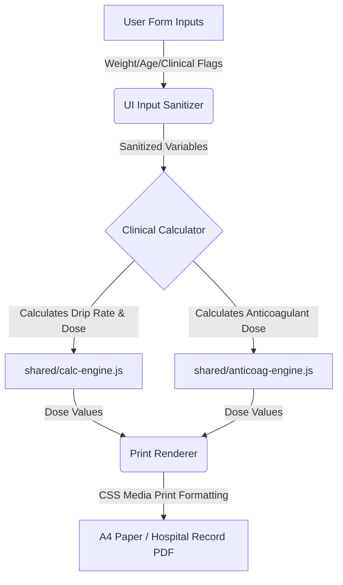

# Architecture Guidelines

## 1. Core Components

| Component | Role | Dependencies |
|---|---|---|
| `Hub (index.html)` | Application portal listing all ER Standing Orders and calculators in a single 3-column grid. Cards have color-coded left borders per medical category (Cardiac #c0392b, Pulmonary #2980b9, Neurology #8e44ad, Anticoagulation #16a085, Toxicology #d35400, Procedural #27ae60, Tools #2c3e50). No section titles, no emoji icons, no print-blank buttons (removed per ADR-09). Stroke FAST TRACK is first card. Portal header (logo + title card) removed — nav bar replaces it. Tablet (600–900px) → 2 columns, mobile (<600px) → 1 column. Backward-compatible redirect for legacy rTPA URLs. | None |
| `calc-engine.js` | Generic mathematical engine computing infusion drip rates (mL/hr) and loading doses (mL). | None |
| `anticoag-engine.js` | Logic engine determining Heparin/LMWH doses and titration changes based on clinical indications. | None |
| `drug-data.js` | Structured catalog of concentrations, dose limits, safety ceilings, and titration instructions for all 12 IV drugs. | None |
| `components.js` | Renders common UI elements: patient info blocks, sticker boxes (HN set via `textContent` for XSS safety), date-time inputs, sticky top navigation bar (`injectNavBar` — accepts optional `homeHref`, `logoSrc`, and `pageTitle` for path/logo/title flexibility; `pageTitle` can be `undefined` for auto-detect, empty string `''` to suppress, or explicit string to override; auto-detects remaining title from `document.title`, sets `role="navigation"`, adds `aria-label` to both Home link and title span), floating print action bar (`showFloatBar`/`hideFloatBar`). Float bar uses text-only labels (no emoji per ADR-09). Negative margin math (`width: calc(100% + var(--page-pad) * 2)`, `margin: calc(var(--page-pad) * -1)`) now reads `--page-pad` CSS var for flexible breakout from body padding (see `base.css` §2). | None |
| `print-bootstrap.js` | Shared print/page lifecycle: `handlePrintBlankDirect()` (URL param detection for HTML blank print), `handlePrintBlankDirectPdf(path)` (URL param detection → redirect to source PDF), `openBlankPdf(path)` (opens source PDF in new tab — user presses print manually, no cross-tab `.print()` per ADR-09), `showResults()` (unhide + float bar + scroll), `clearResults(formId, extraFn)` (reset + hide + focus), `getDateTimeHTML(useTime, date)`, `getBlankDateTimeHTML()`. 5 of 7 order pages use the PDF pathway (ADR-17); rtpa/nstemi keep HTML blank print. | `components.js` |
| `blank-print-engine.js` | Declarative blank-print reset engine. Each order page registers a manifest of reset rules (`{ id, value }` for textContent, `{ id, html }` for innerHTML, `{ id, className }` for class override, `{ id, style }` for style props, `{ selector, checked }` for checkboxes). `apply()` executes all rules. Used by rtpa.html and nstemi.html only (ADR-17 — 5 other pages now open source PDFs instead). Fixes the ADR-10 bug class at the root — adding a new protocol page is now a manifest array, not a hand-written reset block. | None |
| `form-validate.js` | Non-blocking form validation — replaces `alert()` calls across all order pages. `fail(inputId, msg)` highlights field + inline message. `warn(msg)` shows clinical warning banner. `range(inputId, min, max, msg)` and `min(inputId, minVal, msg)` for numeric validation. `clearAll()` resets all errors. Uses existing `.field-error` CSS + new `.inline-error-msg` and `.clinical-warning` classes. | `components.js` |
| `orders/*.html` | Specialized clinical worksheets (rt-PA, STEMI, NSTEMI, PE, Antivenom, Heparin, Sedation). All 7 files use `ED_PRINT_BOOTSTRAP` for page lifecycle and `ED_VALIDATE` for non-blocking validation. Zero `alert()` calls. 5 pages (stemi, pe, heparin, antivenom, sedation) use `ED_PRINT_BOOTSTRAP.openBlankPdf()` to open source PDFs from `docs/` in a new tab (ADR-17). 2 pages (rtpa, nstemi) keep `ED_BLANK_PRINT` for HTML blank-print (no source PDF). Page-specific JS reduced to: form submit handler (clinical logic) + event listeners for protocol-specific UI. | `shared/base.css`, `shared/print.css`, `shared/calc-engine.js` or `shared/anticoag-engine.js`, `shared/components.js`, `shared/print-bootstrap.js`, `shared/form-validate.js` (rtpa/nstemi also load `shared/blank-print-engine.js`) |
| `tools/drip-calculator.html` | IV infusion drip rate calculator for 12 high-alert drugs. Loads `components.js` and uses `injectNavBar()` with hospital logo for nav consistency. No print flow (no `print.css`). | `shared/base.css`, `shared/calc-engine.js`, `shared/drug-data.js`, `shared/components.js` |
| `index.html` | Portal hub with nav bar (`injectNavBar('index.html', logoPath)`). 3-column card grid (no card descriptions — removed per ADR-05), backward-compat redirect. Features glassmorphic portal cards with branded category tags, color-coded interactive hover glows, chevron icons, and a staggered fade-in loading animation. Registers service worker for offline PWA support. Body uses inline `display: block` override. | `shared/base.css`, `shared/components.js`, `service-worker.js`, `manifest.json` |
| `service-worker.js` | PWA offline cache. Network-first for navigation, cache-first for assets. Caches all HTML/CSS/JS + 3 shared behavior modules + logo PNG + 5 source PDFs + Google Fonts. `CACHE_VERSION` bumped to `er-hub-v9`. Enables full offline access during ED wifi outages. | None |
| `manifest.json` | PWA manifest. App name, theme color, logo icon reference. Enables installable app + offline. | `docs/Logo_of_Maharat_Nakhon_Ratchasima-removebg-preview.png` |

---

## 2. Data Flow

1. **Input Collection (`Src`):** User inputs patient variables (HN, age, weight, creatinine — eGFR derived automatically via CKD-EPI 2021 from Cr+age+sex in shared/anticoag-engine.js) and selects drug/indication options in the active worksheet.
2. **Clinical Processing (`Transform`):** Sanitized inputs are processed by `shared/calc-engine.js` or `shared/anticoag-engine.js` referencing data structures in `shared/drug-data.js`.
3. **Print Output (`Dest`):** Output values are written directly to target print containers in the DOM, then converted into an official A4 medical order sheet via the browser print driver using `shared/print.css`.

---

## 3. Offline Decisions

| Entity | Conflict Resolution | Sync Strategy |
|---|---|---|
| `Patient Form State` | Client-only state. Form resets immediately on navigation or tab close. | No server sync. Strictly offline-first. |
| `Calculation Engine` | Pure functional operations. Standard math guarantees deterministic outcomes. | Stored as local `.js` scripts. Loaded from disk. |
| `PWA Assets Cache` | Service worker (`service-worker.js`) registered on index.html. Network-first for navigation, cache-first for static assets. Caches all HTML/CSS/JS + Google Fonts for offline access. | Assets cached in browser via Cache API. Cache version bumped on deploy. |

---

## 4. Clinical & System Warnings

- **W-01: Absolute SK Contraindication:** Users selecting Streptokinase (SK) who flag a prior SK administration within 6 months are permanently blocked from generating the order. They must use Tenecteplase (TNK).
- **W-02: Individualized Dosing Bypass:** For Heparin and Antivenom protocols, matching any pre-defined clinical risk factors (e.g., active bleeding, platelet count < 50,000) disables automatic calculations, forcing user consultation with the attending staff.
- **W-03: Max Dose Ceilings:** The calculation engine automatically caps values at the clinical upper limit (e.g., Fentanyl drip maxed at 500 mcg/hr, rt-PA maxed at 90mg or 50mg based on regimen) to prevent accidental overdosage.
- **W-04: Print Blank Order Bypass:** Two pathways (ADR-17): (1) 5 pages (stemi, pe, heparin, antivenom, sedation) open the source PDF from `docs/` in a new browser tab via `ED_PRINT_BOOTSTRAP.openBlankPdf(path)` — the clinician presses print manually in the native PDF viewer (no cross-tab `.print()` per ADR-09). (2) 2 pages (rtpa, nstemi) render a blank HTML template on-screen via `ED_BLANK_PRINT.apply()` — clinician prints via the green print button or floating action bar. Both pathways bypass all screen validation. The home portal no longer has print-blank buttons (removed per ADR-09). `?print-blank-direct=true` URL param works for both: PDF pages redirect to the PDF, HTML pages trigger blank print.
- **W-05: Lab/IV/O2 Hygiene:** Lab investigations, IV fluids, oxygen, monitoring, and non-drug continuation orders are always rendered as unchecked (☐) in the print output — even when patient data has been entered. Only drug-related orders (ASA, Clopidogrel, Fentanyl, Midazolam, Heparin dosing, Antivenom dosing, Antibiotics) auto-check (☑) based on input data. This prevents accidental pre-checking of investigations that must be ordered by the attending physician.
- **W-06: A4 Print Fit:** All order pages use `@page { size: A4 portrait; margin: 0 }` with `body { width: 210mm; display: block !important }` to override the screen flex layout. Results container uses `padding: 5mm` for print margins. The 5-column order grid drops `min-width: 900px` in print, uses `font-size: 8pt`, and `page-break-inside: avoid` to keep the grid intact on one page. Stroke-specific pages (rt-PA) use `width: 195mm; margin: 0 auto; padding: 3mm 0` with `page-break-before: always` for multi-page documents — matching the original rtpamnrh.vercel.app layout. Sticker box: 60mm × 20mm (compact, matching stroke page sticker dimensions). The sticky top navigation bar is hidden in print across all 7 order pages via `nav`, `.top-nav`, and `a[href*="index.html"]` selectors in `@media print`. rt-PA order grid includes `10em` spacer divs before doctor signature lines (ลงชื่อแพทย์ ER/MED and ลงชื่อแพทย์ MED) to fill the A4 page height. Portal header padding reduced to `16px 20px` (was `32px 20px`), logo to `64px` (was `88px`), margin-bottom to `16px` (was `30px`) for a compact header.
- **W-07: Hardcoded Checkbox Reset on Blank Print:** All non-dynamic ☑ items (medications, monitoring instructions, diet orders) in the results area are tagged with IDs and explicitly reset to ☐ when printing a blank order. This prevents pre-checked medications (Clopidogrel, Ativan, Atorvastatin, Augmentin, etc.) from appearing on blank orders intended for new patients. Affected files: rtpa (10 items), nstemi (12 items) — the 2 pages that still use HTML blank-print. The 5 PDF-pathway pages (stemi, pe, heparin, antivenom, sedation) no longer use `ED_BLANK_PRINT` (ADR-17). Antivenom antibiotic toggle (F3 fix, ADR-17): `p-augmentin` and `p-cipro-clinda` now toggle based on penicillin-allergy radio input — no longer both hardcoded ☑.
- **W-08: Use-Current-Time Checkbox:** All 5 order files with the `use-current-time` checkbox (pe, heparin, antivenom, nstemi, rtpa) wire it to the date/time generation logic — when unchecked, date/time fields render as dotted lines instead of the current time.
- **W-09: Iframe Print Cleanup (Deprecated):** The home portal's `printBlankOrder()` function was removed (ADR-13). ADR-09 eliminated all portal print-blank buttons, making the function dead code. The `afterprint` + 5-minute timeout pattern is documented for historical reference only.
- **W-10: Nav Overflow Fix (2026-07-02, Phase 1 — BUG-01):** Introduced CSS custom property `--page-pad` to decouple `.top-nav` breakout math from hardcoded body padding. Pages set `body { --page-pad: 0px }` (index.html) or inherit default `--page-pad: 20px` (order pages). Nav margin calculations now read `calc(var(--page-pad) * -1)` instead of `-20px`. Responsive breakpoints update `--page-pad` cleanly at media query boundaries (10px at 900px, 8px at 600px). Eliminates 20px overflow on pages where body padding differs from default.
- **W-11: PE Hard-Stop Doesn't Stop Fix (2026-07-02, Phase 1 — BUG-02):** Added `return;` statement immediately after both `ED_VALIDATE.warn()` calls (lines 316 & 322) in `pe.html` for absolute-CI and SK-repeat checks. Also retracts stale order on re-submission via `classList.add('hidden')` on results-container. Prevents clinician from accidentally printing contraindicated PE standing order via Ctrl+P despite print-button being visually locked. New structural regression guard: `tests/order-safety-guard.test.js` (30 tests) scans all order files for this hard-stop pattern and asserts `return;` follows `warn()` within 4 lines.
- **W-12: injectNavBar pageTitle Parameter (2026-07-02, Phase 3 — BUG-04):** Extended `injectNavBar()` signature to accept optional third parameter `pageTitle`. Can be `undefined` (auto-detect from `document.title`), empty string `''` (suppress title, show only logo + "Home"), or explicit string (override title). `index.html` passes `''` → homepage shows only logo + Home link, no redundant "MNRH-ED Standing Order Hub" title. Eliminates visual redundancy on the portal page.
- **W-13: SW Precache Robustness + Retry Logic (2026-07-02, Phase 3 — BUG-05):** Replaced `cache.addAll(ASSETS)` with custom `fetchWithRetry()` helper (2 retry attempts, 100ms exponential backoff) + `Promise.allSettled()` precache loop. Individual asset fetch failures no longer block the entire install event. Failed assets logged as warnings but don't prevent SW activation. Next fetch will auto-retry missing assets. Resilient to transient network issues during offline access cache setup. Bumped `CACHE_VERSION` from `er-hub-v1` to `er-hub-v2`.
- **W-14: NSTEMI Dead ID Reference Safety (2026-07-04):** All elements queried in standing order handlers must be statically validated against DOM declarations. The ID integrity guard regression suite enforces that no queried IDs in `$()` or registry manifests are missing in the HTML source, ensuring zero runtime TypeErrors on execution.
- **W-15: Homepage Design Optimization & SW v4 (2026-07-04):** Revamped the portal dashboard design with HSL-tailored category colors, glassmorphism card visual styling, uppercase text tags (e.g. "NEUROLOGY"), chevron hover transitions, and load animations. Scoped styles locally inside index.html to isolate changes and avoid regressions on clinical worksheets. Bumped service worker CACHE_VERSION to er-hub-v4 to trigger automatic update checks on client browsers.

---

## 5. Architectural Decision Records (ADRs) — Part 2

### ADR-18: Test Coverage & CSS Custom Properties (2026-07-02 Audit)

**Context:** Post-ADR-17 audit (v3, 2026-07-02) identified three infrastructure gaps: (1) zero test coverage for shared behavior modules (`form-validate.js`, `print-bootstrap.js`), (2) nav bar hard-coded to `20px` margins breaks on pages with custom body padding (BUG-01), (3) PE hard-stop warn doesn't actually stop (BUG-02 — returns false but execution continues), (4) homepage displays redundant title in nav bar (BUG-04), (5) service-worker precache is brittle (BUG-05).

**Decision:**

  1. **Phase 1 — Clinical Safety (BUG-01 & BUG-02 + Regression Guard):**
     - BUG-01 (Nav Overflow): Introduced `--page-pad` CSS custom property. `index.html` sets `body { --page-pad: 0px }`, order pages inherit/default `--page-pad: 20px`. `.top-nav` margin calculations now read `calc(var(--page-pad) * -1)` instead of hardcoded `-20px`. Responsive breakpoints update `--page-pad` (10px at 900px, 8px at 600px). Eliminates overflow on pages with non-default body padding.
     - BUG-02 (PE Hard-Stop No-Op): Added `return;` immediately after both `ED_VALIDATE.warn()` calls in `pe.html` (lines 316 & 322). Also retracts stale order via `classList.add('hidden')`. Now matches correct pattern in `stemi.html`/`antivenom.html`.
     - Regression Guard: Added `tests/order-safety-guard.test.js` (30 tests) — structural guard that scans all order pages for the hard-stop pattern, asserts `return;` follows `warn()` within 4 lines. **Catches BUG-02 if accidentally reverted.**
  2. **Phase 2 — Test Coverage:**
     - `tests/form-validate.test.js` (63 tests) — contract tests for ED_VALIDATE module. Covers: `fail()`, `clear()`, `range()`, `min()`, `warn()`, `clearWarn()`, `clearAll()`. Tests non-blocking behavior, boundary values, PE weight 30–200kg protocol, hard-stop pattern.
     - `tests/print-bootstrap.test.js` (31 tests) — contract tests for ED_PRINT_BOOTSTRAP module. Covers: `handlePrintBlankDirect()`, `handlePrintBlankDirectPdf()`, `openBlankPdf()`, `showResults()`, `clearResults()`, date/time helpers. Tests print-pathway detection, URL params, blank-order workflow, results hide/show, form reset.
     - All 60 new tests pass (124/124 total suite).
  3. **Phase 3 — Polish (BUG-04 & BUG-05):**
     - BUG-04 (Homepage Title): Extended `injectNavBar()` signature to accept optional `pageTitle` param. `undefined` = auto-detect from `document.title`, `''` = suppress title, explicit string = override. `index.html` passes `''` → homepage shows only logo + "Home", no redundant title.
     - BUG-05 (SW Precache Robustness): Replaced `cache.addAll(ASSETS)` with custom `fetchWithRetry()` helper (2 retries, 100ms exponential backoff) + `Promise.allSettled()` loop. Individual fetch failures no longer block install. Failed assets logged as warnings. Next fetch auto-retries. Bumped `CACHE_VERSION` from `er-hub-v1` to `er-hub-v2`.

**Rationale:** The CSS custom property approach isolates nav layout logic from page-specific body padding, making it resilient to future pages with custom layouts. The hard-stop `return;` fix is a critical patient-safety change — it closes the risk of contraindicated orders being printable. The regression guard ensures this class of bug cannot reappear without test failure. Test coverage on shared modules provides a safety net for future refactoring. The `pageTitle` param eliminates redundant nav titles on pages where auto-detect duplicates content. The SW precache robustness ensures offline access works reliably even with transient network issues during cache setup.

---

### ADR-19: NSTEMI UI Overhaul — 2025 ACC/AHA Guideline + CKD-EPI 2021 (2026-07-02)

**Context:** NSTEMI Standing Order page (v1.x) had structural issues: (1) eGFR was a manual input field instead of derived value, violating single-source-of-truth principle — creatinine is the measured value, eGFR should be calculated; (2) anticoagulant dosing used outdated age-based criteria (age ≥75 → 0.75 mg/kg) from CR-NSTEMI document, which is STEMI+fibrinolytic-specific and NOT applicable to NSTEMI per 2025 ACC/AHA guideline; (3) troponin kinetics lacked manual time input capability for %rising calculation; (4) header/nav redundancy with ESC 2023 reference only.

**Decision:**

  1. **Engine Updates (shared/anticoag-engine.js):**
     - Added `calcEGFR_CKDDEPI2021(creatinine, age, sex)` — implements CKD-EPI 2021 creatinine equation (race-free): `eGFR = 142 × min(Scr/κ, 1)^α × max(Scr/κ, 1)^-1.200 × 0.9938^Age × (1.012 if female)` where κ = 0.7 (female) / 0.9 (male), α = -0.241 (female) / -0.302 (male). Returns eGFR in mL/min/1.73m².
     - Rewrote `calcAnticoag()` — removed age ≥75 branch (was 0.75 mg/kg, incorrect for NSTEMI). New logic: eGFR ≥30 → Fondaparinux 2.5 mg SC OD + Enoxaparin 1 mg/kg SC q12h; eGFR 15-29 → Enoxaparin 1 mg/kg SC q24h; eGFR <15 → Heparin drip. Aligns with 2025 ACC/AHA/ACEP/NAEMSP/SCAI Guideline for Management of Patients With Acute Coronary Syndromes.
     - Added 6 unit tests for `calcEGFR_CKDEPI2021()` (male/female, age/Scr ranges, invalid inputs) + updated 8 anticoag tests to remove age-based assertions.
  2. **UI Simplification (orders/nstemi.html):**
     - Removed header block (h1 + hospital name + ESC 2023 + version string) — redundant with nav bar. Removed hr divider.
     - Patient info row: collapsed to single-line flexbox (`.patient-fields` nowrap): HN, Age, Weight(kg), Sex(M/F), Creatinine(mg/dL). eGFR derived live and displayed in `.egfr-derived` badge.
     - Added 3-column troponin kinetics section: H0 ng/L, H1 ng/L, H3 ng/L (each with manual time input HH:MM). %rising auto-calculated as ((H1-H0)/H0 × 100) and ((H3-H0)/H0 × 100).
     - GRACE Variables: Creatinine input synced with Patient Info Creatinine (same `id="creatinine"` referenced in both sections). eGFR no longer an input — removed to prevent data conflict.
     - Continuation column (Col 5): Replaced hardcoded "Enoxaparin 40 mg SC OD" checkbox with 3 anticoagulant options (Fondaparinux / Enoxaparin / Heparin). Each shows calculated dose from engine + hint text (eGFR-based indication). Only the doctor-selected medication receives ☑ check in print output.
     - Nav bar: passed explicit title with 2025 ACC/AHA reference: `"NSTEMI Standing Order — MNRH | 2025 ACC/AHA Anticoag Guideline + CKD-EPI 2021 eGFR"`.
  3. **Removed auto-time features:** Deleted "Use current time" checkbox (`use-current-time`) and all `h1t`/`h3t` computed time logic. Troponin times now manual-only for clinical accuracy.

**Rationale:** eGFR is a derived clinical value, not an input — deriving it from creatinine via CKD-EPI 2021 (gold-standard equation) prevents data entry errors and ensures guideline compliance. The 2025 ACC/AHA guideline supersedes the outdated age-based enoxaparin dosing from CR-NSTEMI document (which applies only to STEMI fibrinolysis). Manual troponin times align with real-world ED workflow where draw times vary by patient and are not always at fixed intervals. The single-line patient info layout reduces vertical space, allowing more room for clinical data below.

**Tests:** All 130 tests pass (6 new CKD-EPI tests + 8 updated anticoag tests). No regressions.

**Consequences:** Older NSTEMI orders printed with v1.x will have different enoxaparin dosing than v2.0 for patients age ≥75 (was 0.75 mg/kg, now 1 mg/kg q24h if renal impairment). This is clinically correct per 2025 guideline.

---

### ADR-20: NSTEMI Standing Order v2.1 — Simplification, Safe eGFR Formatting, and Regression Guards (2026-07-04)

**Context:**
A post-implementation audit of NSTEMI standing order page (v2.0) revealed:

1. Dead DOM element references (`p-h0`, `p-h1`, `p-h3`) left from previous versions caused a Javascript `TypeError` upon calculation execution, preventing result generation and float bar display.
2. Troponin timing inputs (`trop-time-h0`/`1`/`3`) were redundant as the draws are logged in the EMR rather than the standalone sheet.
3. eGFR formatting was inconsistent (some places 1 decimal, some unformatted raw floats) and lacked null guards.
4. The blank order template preview had to be manually toggled.

**Decision:**

1. **DOM & JS Cleanup:**
   - Deleted dead `p-h0`/`p-h1`/`p-h3` print references and screen timing update lines from Javascript.
   - Removed manual troponin timing inputs `#trop-time-h0`/`1`/`3` and `.troponin-times` DOM block.
   - Simplified printed troponin section `#p-troponin-values` to display only static results (e.g. `H0: 12`, `H1: 15 → +25.0%`).
   - Retained the duplicate `#grace-creatinine` input and implemented two-way sync with `#creatinine` to prevent data entry friction.
   - Renamed print Column 1 header to "Progress note" and removed the pharmacist signature block ("ลงชื่อเภสัช:").
2. **eGFR Badge & Layout Repositioning:**
   - Moved the screen eGFR badge `#screen-egfr` directly next to the Creatinine input in the patient demographics row.
   - Relocated the `#troponin-from-rphch` checkbox to the header of the Troponin section.
   - Reverted Risk Stratification back to the original vertical list layout using standard labels.
   - Moved interactive anticoagulant selection radio buttons out of print preview (Column 5) and into the screen results container, adding Enoxaparin frequency q12h vs OD sub-selections with GFR-only hint text "(1 mg/kg — GFR < 30 → once daily)".
   - Relocated print anticoagulant output (`#p-anticoag`) from print Column 3 (One Day Orders) to print Column 5 (Continuation).
3. **eGFR Safe Formatting:**
   - Standardised all eGFR outputs to 2 decimal places (`.toFixed(2)`).
   - Safe-guarded printed output: `egfr !== null ? egfr.toFixed(2) : '___'` to prevent null crashes on form resets.
4. **Blank-First UX:**
   - Auto-trigger the blank print layout by clicking `print-blank-btn` on page load.
5. **Precache Robustness & Testing:**
   - Bumped `CACHE_VERSION` to `er-hub-v3` in `service-worker.js`.
   - Created `tests/id-integrity-guard.test.js` to parse all forms and verify query ID existence in the DOM, preventing dead reference crashes.
   - Bumped NSTEMI version to `2.1.0`.

**Rationale:**
Manual troponin draw times added layout complexity without clinical benefit. Two-way creatinine sync is retained to maintain consistent data entry between demographic and GRACE variables. Reverting Risk Stratification to the original vertical layout keeps layout styling consistent with other order sheets. Separating the calculated eGFR badge next to the creatinine input visually links the input and derived outputs. Safe-guarding formatting and removing dead DOM references prevents runtime TypeErrors. Auto-triggering the blank print preview ensures clinicians see the standing order layout immediately. Bumping SW cache versions ensures quick client updates. The ID integrity guard prevents future dead reference regressions across the suite.

**Tests:**
All 138 tests pass, including the new regression guard testing all 8 interactive files.

---

### ADR-22: Homepage Design Optimization & Local CSS Scoping (2026-07-04)

**Context:** The portal homepage (`index.html`) visually felt outdated and flat compared to modern web design standards. The user requested a visual optimization using `/modern-web-guidance` to create a premium clinical dashboard.

**Decision:**

  1. **Visual Overhaul:** Optimized the layout with a subtle radial gradient background (`#f8fafc` to `#e2e8f0`), glassmorphic portal cards (soft blur, semi-transparent borders, premium drop shadows, `12px` border-radius), and uppercase text tags (e.g., "NEUROLOGY", "CARDIAC") corresponding to the color-coded categories. Tuned card dimensions to be more compact (padding: `16px 20px`, min-height: `80px`, grid gap: `16px`) for an ultra-sleek layout.
  2. **Interactivity & Motion:** Added hover animations including a card vertical translation (`translateY(-4px)`), a color-matched shadow glow, a vertically centered chevron arrow indicator (`→`), and a subtle radial gradient glow inside the card. Implemented a staggered load animation (`fadeInUp`) for the grid cards using CSS animation delays.
  3. **Local Styling Scope:** Scoped all visual styles locally within the `<style>` tag of `index.html` instead of modifying `shared/base.css` to prevent any regressions or layout shifts on the other 7 clinical standing order pages.
  4. **PWA Version Bump:** Bumped the service worker `CACHE_VERSION` to `er-hub-v6` to force immediate client browser updates.
  5. **Favicon Replacement:** Replaced `favicon.svg` with the hospital logo PNG (`docs/Logo_of_Maharat_Nakhon_Ratchasima-removebg-preview.png`) as the favicon across all 9 pages, updated `manifest.json` icons, and removed `favicon.svg` from the cache list.

**Rationale:** Scoping styles locally inside `index.html` satisfies the surgical modification rule by completely isolating the homepage visual design, guaranteeing zero regression risk for the clinical order sheets. Branded category labels and interactive chevrons organize the grid without relying on sections or platform-specific emojis. Staggered animations make the interface feel responsive and modern. Using the official hospital logo as the favicon provides unified branding and consistent tab identification. Compact card sizing increases information density and usability on high-pressure ED terminals.

---

### ADR-23: Enoxaparin Continue Order Checkbox Options (2026-07-04)

**Context:** Thailand clinical settings support Enoxaparin in pre-filled syringe sizes (0.4 ml [40 mg] and 0.6 ml [60 mg]). The NSTEMI continue order printed layout used manual blank lines, which required manual completion and did not guide clinical selection based on pre-packaged stock sizes.

**Decision:**
  1. **Print Layout Update:** Replaced blank lines in continue order (`p-anticoag`) with specific checkboxes formatted over 2 lines:
     - Line 1: `☐ Enoxaparin  ☐ 0.4 ml  ☐ 0.6 ml`
     - Line 2: (Indented 5 spaces) `SC  ☐ q 12 hr  ☐ OD  × 5 Days`
  2. **Auto-Checking Dosing Logic:** Added live calculation rules in `orders/nstemi.html`:
     - If patient weight >= 50 kg (dose >= 50 mg), check the `0.6 ml` box.
     - If patient weight < 50 kg (dose < 50 mg), check the `0.4 ml` box.
     - Frequency checkboxes (`q 12 hr` vs `OD`) are checked automatically matching the selected frequency on the screen.
  3. **Refined Guidance Note:** Split the clarification note into 2 lines for readability:
     - Line 1: `(1 mg/kg = [Dose] mg — GFR < 30 → once daily)`
     - Line 2: `(0.4 ml = 40 mg, 0.6 ml = 60 mg)`

**Rationale:** The updated layout reduces error-prone manual writing on printed forms. Formatting the checkboxes and instructions into 2 lines respectively prevents visual clutter in the narrow continuation column print space while ensuring clear stock size guide references.

---

### ADR-24: Anticoagulant Guideline Hints — Fondaparinux & Heparin (2026-07-04)

**Context:** The continue order anticoagulant section lacked explicit contraindication reminders for Fondaparinux and Heparin. Clinicians needed on-sheet guidance per 2025 ACC/AHA and ESC NSTE-ACS guidelines at the point of order writing, without opening an external reference.

**Decision:**
  1. **Fondaparinux — Added 2-line clinical hint:**
     - `(CI: CrCl <30 mL/min — ถ้าทำ PCI ต้องเสริม UFH bolus)`
     - Reflects: (a) absolute contraindication at CrCl <30 mL/min due to renal accumulation and bleeding risk; (b) catheter thrombosis risk when Fondaparinux used as sole anticoagulant during PCI — guideline mandates a UFH bolus at the time of PCI.
  2. **Heparin IV — Updated indication label:**
     - Changed from `(กรณี GFR < 15)` → `(eGFR <15 หรือ CrCl <30 mL/min)` to clarify the two complementary thresholds used in LMWH/Fondaparinux crossover decision.
  3. **Enoxaparin label — Removed redundant "SC" from Line 1:**
     - `☐ Enoxaparin SC  ☐ 0.4 ml  ☐ 0.6 ml` → `☐ Enoxaparin  ☐ 0.4 ml  ☐ 0.6 ml`
     - "SC" is already stated explicitly on Line 2 (`SC  ☐ q 12 hr  ☐ OD × 5 Days`), making it redundant on Line 1.
  4. **Scope:** All changes applied to both dynamic print output (`getSelectedAnticoagPrintHTML()`) and blank print template (`p-anticoag` item in `ED_BLANK_PRINT`).

**Rationale:** Point-of-care guideline hints reduce cognitive load and prevent prescribing errors without requiring clinicians to recall guidelines from memory during a high-acuity resuscitation. The CrCl <30 absolute CI for Fondaparinux is the most consequential prescribing boundary and warrants explicit on-sheet notation. The PCI/UFH bolus note prevents a common gap where a patient managed conservatively on Fondaparinux is transitioned to PCI without anticoagulant bridging.

**Evidence Base:** 2025 ACC/AHA NSTE-ACS Guidelines; ESC 2023 NSTE-ACS Guidelines.

**Tests:** 138/138 pass post-change (DOM ID integrity guard confirmed).
