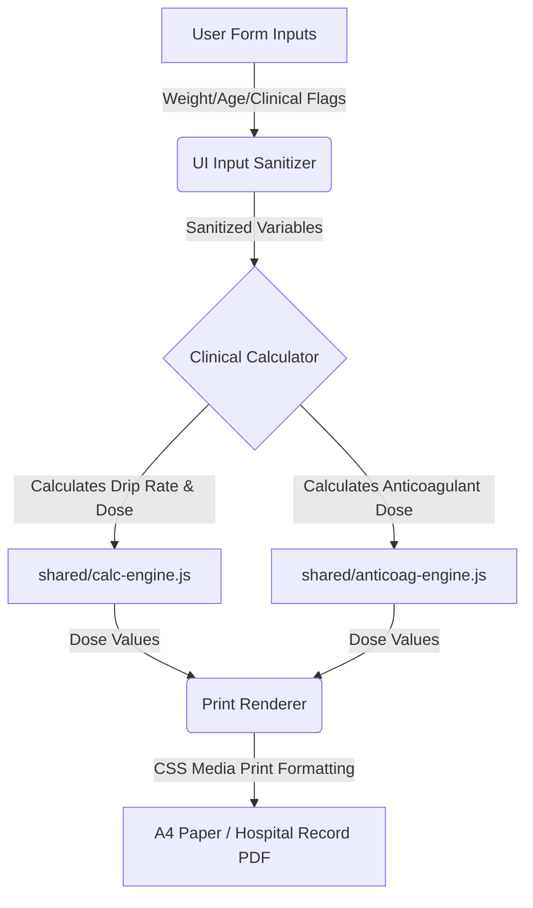

# Architecture Guidelines

## 1. Core Components

| Component | Role | Dependencies |
|---|---|---|
| `Hub (index.html)` | Application portal listing all ER Standing Orders and calculators. Direct entry point. | None |
| `calc-engine.js` | Generic mathematical engine computing infusion drip rates (mL/hr) and loading doses (mL). | None |
| `anticoag-engine.js` | Logic engine determining Heparin/LMWH doses and titration changes based on clinical indications. | None |
| `drug-data.js` | Structured catalog of concentrations, dose limits, safety ceilings, and titration instructions for all 12 IV drugs. | None |
| `components.js` | Renders common UI elements: patient info blocks, barcode/sticker print boxes, and date-time inputs. | None |
| `orders/*.html` | Specialized clinical worksheets (rt-PA, STEMI, NSTEMI, PE, Antivenom, Heparin, Sedation) displaying forms and generating print layouts. | `shared/base.css`, `shared/print.css`, `shared/calc-engine.js`, `shared/components.js` |

---

## 2. Data Flow

1. **Input Collection (`Src`):** User inputs patient variables (HN, age, weight, eGFR) and selects drug/indication options in the active worksheet.
2. **Clinical Processing (`Transform`):** Sanitized inputs are processed by `shared/calc-engine.js` or `shared/anticoag-engine.js` referencing data structures in `shared/drug-data.js`.
3. **Print Output (`Dest`):** Output values are written directly to target print containers in the DOM, then converted into an official A4 medical order sheet via the browser print driver using `shared/print.css`.

---

## 3. Offline Decisions

| Entity | Conflict Resolution | Sync Strategy |
|---|---|---|
| `Patient Form State` | Client-only state. Form resets immediately on navigation or tab close. | No server sync. Strictly offline-first. |
| `Calculation Engine` | Pure functional operations. Standard math guarantees deterministic outcomes. | Stored as local `.js` scripts. Loaded from disk. |
| `PWA Assets Cache` | Local service worker enforces version caching. | Assets cached in browser. Auto-updates on cache-busting tag change. |

---

## 4. Clinical & System Warnings

- **W-01: Absolute SK Contraindication:** Users selecting Streptokinase (SK) who flag a prior SK administration within 6 months are permanently blocked from generating the order. They must use Tenecteplase (TNK).
- **W-02: Individualized Dosing Bypass:** For Heparin and Antivenom protocols, matching any pre-defined clinical risk factors (e.g., active bleeding, platelete count < 50,000) disables automatic calculations, forcing user consultation with the attending staff.
- **W-03: Max Dose Ceilings:** The calculation engine automatically caps values at the clinical upper limit (e.g., Fentanyl drip maxed at 500 mcg/hr, rt-PA maxed at 90mg or 50mg based on regimen) to prevent accidental overdosage.
- **W-04: Print Blank Order Bypass:** Users can print empty orders via two pathways: (1) **Direct Print from Home Page** — clicking "🖨️ พิมพ์ใบสั่งยาเปล่า" on any portal card creates a hidden iframe loading `orders/[name].html?print-blank-direct=true`, which auto-renders the blank template and triggers `window.print()` without navigating away. (2) **Preview-First from Worksheet** — clicking "🖨️ ใบสั่งยาเปล่า (Blank Order)" inside a worksheet renders the blank preview on-screen without auto-printing; the clinician reviews and prints via the standard green print button. Both pathways bypass all screen validation constraints and output standard checklists with empty dotted lines for manual clinical entries.
